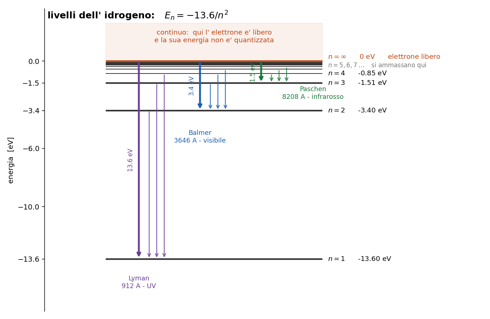

# Numeri e conversioni da avere in tasca

_Questo capitolo non spiega niente, quindi non ha un metodo: e' una cassetta degli attrezzi.
Leggilo di corsa la prima volta e torna qui quando serve._

Questo capitolo non spiega niente. E' la roba che conviene sapere a memoria, perche' torna in ogni
singolo capitolo dopo e perche' avere il numero in testa ti fa capire subito se una cosa e'
plausibile oppure no.

Se stai iniziando adesso, leggilo di corsa e torna qui quando serve.

---

## 1. La conversione più usata di tutte

$$\lambda [\unicode{xC5}] = \frac{12400}{E [eV]}$$

Energia in elettronvolt, lunghezza d' onda in Angstrom. Questa la userai venti volte.

**Attenzione al verso**: e' una **divisione**, non una moltiplicazione. Piu' energia = lunghezza
d' onda piu' corta.

Esempio: una riga a 5007 A a che energia corrisponde? $12400 / 5007 = 2.48$ eV.
Al contrario: un livello a 2.48 eV che riga fa? $12400 / 2.48 = 5000$ A circa.

_**SIGNIFICATO FISICO:** avere questa in mano vuol dire poter passare in ogni momento dal
mondo delle righe (quello che osservi) al mondo dei livelli di energia (quello che spiega). Sono la
stessa cosa scritta in due unita' diverse._

---

## 2. Temperatura in energia

$$k_B T [eV] = \frac{T [K]}{11600}$$

e al contrario, la temperatura che serve per avere in mano una certa energia:

$$T [K] = \chi [eV] \times 11600$$

| T | $k_B T$ |
|---|---|
| 5800 K (Sole, superficie) | 0.5 eV |
| $10^4$ K (nebulosa tipica) | **0.86 eV** |
| $10^5$ K | 8.6 eV |

**Quello da ricordare e' 0.86 eV**, perche' e' l' energia tipica degli elettroni in una nebulosa e
torna in continuazione: e' il metro con cui misuri se un livello e' raggiungibile o no per via
collisionale.

---

## 3. L'idrogeno

$$E_n = -\frac{13.6}{n^2} \; eV$$

Da cui, l' energia per salire dal fondamentale al livello $n$:

$$\chi_{1n} = 13.6 \left( 1 - \frac{1}{n^2} \right) \; eV$$

_**Attenzione:** e' $13.6 (1 - 1/n^2)$, non $13.6 / (1 - n^2)$. E' un errore facile da fare e ti
manda fuori strada di brutto._

---

### 3.1 Le quattro energie che contano

| quanto | cosa fa | riga |
|---|---|---|
| **10.2 eV** | sale da $n=1$ a $n=2$ | Ly$\alpha$, 1216 A |
| **13.6 eV** | ionizza da $n=1$ | limite di Lyman, 912 A |
| **3.4 eV** | ionizza da $n=2$ | limite di Balmer, 3646 A |
| **1.51 eV** | ionizza da $n=3$ | limite di Paschen, 8208 A |

Nota che 3.4 e' esattamente $13.6/4$, e 1.51 e' $13.6/9$: sono lo stesso numero diviso $n^2$.

_**Nota subito così de botto:** il limite di Balmer sta a **3.4 eV**, non a 13.6. E' un errore in
cui si casca sempre, perche' "13.6" viene automatico appena si sente "ionizzare l' idrogeno". Ma
se l' elettrone parte gia' da $n=2$ ha gia' fatto meta' strada, e gliene servono molti meno._

---

### 3.2 Le righe di Balmer

| riga | $\lambda$ | transizione |
|---|---|---|
| H$\alpha$ | 6563 A | $3 \to 2$ |
| H$\beta$ | 4861 A | $4 \to 2$ |
| H$\gamma$ | 4340 A | $5 \to 2$ |
| H$\delta$ | 4102 A | $6 \to 2$ |

Tutte finiscono su $n=2$ e cadono nel visibile: e' per questo che l' idrogeno si studia con Balmer
e non con Lyman, che sta tutta nell' ultravioletto.

Le distanze fra righe consecutive si stringono man mano che si sale, e si accumulano contro il
limite a 3646 A.

---

### 3.3 Peso statistico

$$g_n = 2 n^2$$

Quindi $g_1 = 2$, $g_2 = 8$, $g_3 = 18$. E le funzioni di partizione dell' idrogeno:

$u_0 \approx 2$ $\quad$ per l' idrogeno neutro (a temperature normali domina il fondamentale)

$u_1 = 1$ $\quad$ per l' idrogeno ionizzato: e' un protone nudo, ha un solo stato possibile

---

## 4. L'elio

| | energia |
|---|---|
| ionizzare He I (neutro -> He II) | **24.6 eV** |
| ionizzare He II (-> He III) | **54.4 eV** |

E i livelli dell' He$^+$, che ha un elettrone solo come l' idrogeno ma carica nucleare doppia:

$$E_n = -\frac{54.4}{n^2} \; eV$$

Cioe' esattamente quattro volte l' idrogeno, perche' l' energia va come $Z^2$.

---

## 5. Densità: gli ordini di grandezza

| dove | $N_e$ |
|---|---|
| fotosfera stellare | $\sim 10^{14}$ cm$^{-3}$ |
| nebulosa planetaria | $10^3 - 10^4$ cm$^{-3}$ |
| regione H II | $10^2 - 10^3$ cm$^{-3}$ |
| mezzo interstellare diffuso | $\sim 1$ cm$^{-3}$ |

Tienile a mente perche' sono la chiave di lettura di meta' corso: la stessa fisica, applicata a
densita' che differiscono di dieci ordini di grandezza, da' risultati opposti.

---

## 6. Notazione: i numeri romani

Il numero romano indica lo **stadio di ionizzazione**, e vale **uno in piu'** del numero di
elettroni persi:

| scritto | vuol dire |
|---|---|
| H I | idrogeno **neutro** |
| H II | idrogeno ionizzato (un protone) |
| O III | ossigeno che ha perso **due** elettroni |
| He II | elio che ha perso **un** elettrone |

Regola: **numero romano = $i + 1$**, dove $i$ e' quanti elettroni ha perso.

E le parentesi quadre, come in **[O III]**, vogliono dire che quella e' una **riga proibita**.
Se ne parla nel [capitolo 5.7](c057_righe_proibite.md).

---

## 7. Un'altra trappola di notazione

Nel [capitolo 2](c02_boltzmann_saha.md), $N_0$ e $N_1$ sono **stadi di ionizzazione** (neutro,
ionizzato una volta).

Nel [capitolo 5](c051_atomo_due_livelli.md), $N_1$ e $N_2$ sono **livelli energetici** dello stesso
ione.

Stessa scrittura, cose completamente diverse. Guarda sempre di che capitolo si sta parlando.

---

## 8. In breve

Le tre che se sai solo quelle te la cavi:

- $\lambda[\unicode{xC5}] = 12400 / E[eV]$
- $k_B T = 0.86$ eV a $10^4$ K
- $E_n = -13.6/n^2$ per l' idrogeno

---

## Domande tattiche

Queste sono di riscaldamento, ma se ne sbagli una torna indietro subito.

**1.** Una riga cade a 4363 A. A che energia sta il salto che la produce? E se ti dicessi 2321 A,
in che parte dello spettro saresti? (-> sezione 1)

**2.** In una nebulosa a $10^4$ K, un elettrone medio riesce a portare un atomo di idrogeno dal
fondamentale a $n=2$? Fai il confronto coi numeri, non a occhio. (-> sezioni 2 e 3.1)

**3.** Ti dicono "per ionizzare l' idrogeno servono 13.6 eV". In che caso questa frase e'
sbagliata? (-> sezione 3.1)

**4.** Cosa vuol dire esattamente [O III], e in cosa e' diverso da O III? (-> sezione 6)
