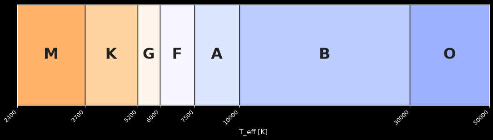
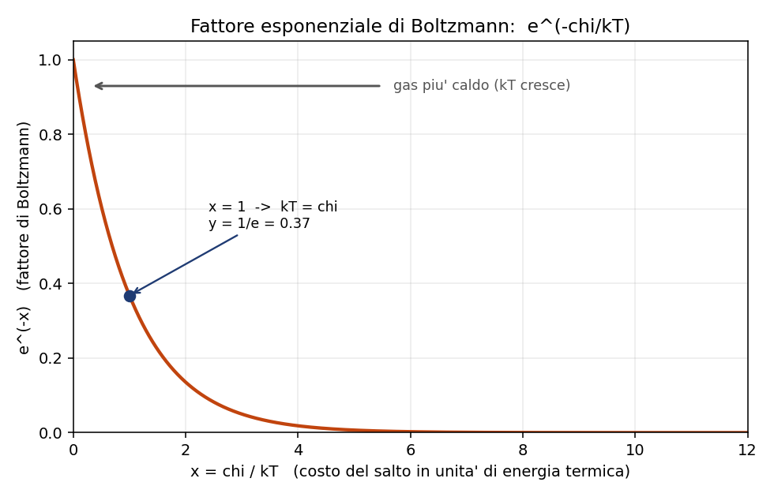
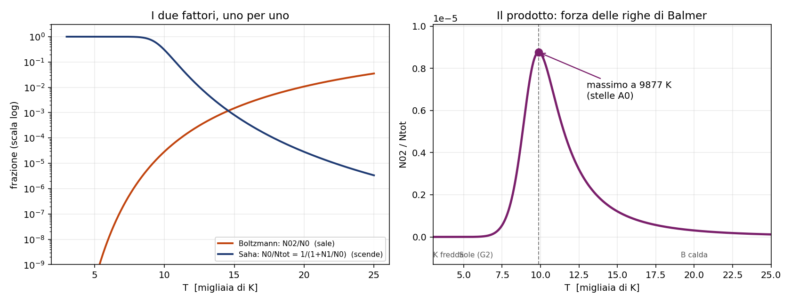

# 2 - Popolazioni: Boltzmann, Saha e perche' Balmer ha un massimo

**Dispensa: cap. 2 (pag. 19-34).**

_Capitolo in **PODS**. Le formule qui sono due e si imparano in un pomeriggio, la fatica sta nel
capire perche' servono: si parte
da un dato osservativo, si mette l' obiezione che lo rende assurdo, e solo dopo si tirano
fuori gli strumenti._

Questo capitolo risponde a una domanda sola, ed e' una domanda che viene da un dato osservativo:

> guardo le stelle lungo la sequenza spettrale, e le righe di Balmer sono debolissime nelle O,
> diventano fortissime nelle A0, e poi tornano deboli nelle K e M. **Perche' c'e' un massimo in
> mezzo?**

Se le righe di Balmer venissero dall' idrogeno, e l' idrogeno c'e' dappertutto, uno si aspetterebbe
che siano piu' o meno uguali ovunque. E invece no.

---

## 1. Cosa serve per fare una riga di Balmer

Prima di tutto capiamo chi le fa, queste righe.

Le righe di Balmer sono transizioni che partono (in assorbimento) dal livello $n=2$ dell' idrogeno
neutro. Quindi per vederle mi serve un atomo che sia:

1. **neutro** (se e' ionizzato non ha piu' l' elettrone, non assorbe niente)
2. **eccitato su $n=2$** (se sta sul fondamentale assorbe in Lyman, che e' nell' UV e da terra non
   si vede)

Due condizioni **in contrasto fra loro**, ed e' tutto li'.

_**NOTA BENE:** questa e' la struttura logica di tutto il capitolo. Ogni volta che
in fisica trovi un massimo, quasi sempre e' perche' hai due condizioni che tirano in direzioni
opposte, una che cresce e una che cala._

---

## 2. Primo pezzo: quanti sono eccitati su n=2? (Boltzmann)

Dentro un atomo neutro, come si spartiscono gli elettroni fra i livelli? Lo dice Boltzmann:

$$\frac{N_{i,n}}{N_i} = \frac{g_{i,n}}{u_i(T)} e^{-\chi_{i,n} / k_B T}$$

$N_{i,n}$ $\quad$ quanti atomi dello ione $i$ stanno sul livello $n$

$N_i$ $\quad$ quanti atomi di quello ione ci sono in totale

$\chi_{i,n}$ $\quad$ quanto costa in energia salire dal fondamentale al livello $n$

$g_{i,n}$ $\quad$ il **peso statistico** del livello: quanti stati quantici diversi stanno alla
stessa energia. Per l' idrogeno $g_n = 2n^2$.

$u_i(T)$ $\quad$ la **funzione di partizione**, cioe' la somma di tutti i pesi statistici pesati
col loro esponenziale. E' il normalizzatore: serve a far tornare i conti su tutti i livelli. Per
l' idrogeno neutro a temperature normali $u_0 \approx 2$ (il fondamentale domina e vale 2), mentre
$u_1 = 1$ perche' l' idrogeno ionizzato e' un protone nudo, ha un solo stato possibile.

---

### 2.1 Come si legge

La formula ha **due fattori**, e fanno due cose diverse:

- **l' esponenziale** $e^{-\chi/k_BT}$ e' la penalita' energetica: piu' il livello e' alto, piu' e'
  raro. Cresce con $T$.
- **il rapporto** $g_n / u$ e' un fattore geometrico, conta gli stati: e' li' anche a temperatura
  altissima.

La cosa da tenere: l' esponenziale, quando $T \to \infty$, tende a **1**, non all' infinito. Quindi
Boltzmann **satura**. Per l' idrogeno il massimo che puoi ottenere e'

$$\frac{N_{0,2}}{N_0} \to \frac{g_2}{u_0} = \frac{2 \cdot 2^2}{2} = 4$$

Cioe' per quanto scaldi, non superi quel tetto.

Segnati questo, che fra due paragrafi e' il punto della storia.

---

### 2.2 Un numero per farsi un' idea

A $T = 10^4$ K, per l' idrogeno, il rapporto fra chi sta su $n=2$ e chi sta su $n=1$ vale

$$\frac{N_{0,2}}{N_{0,1}} = 2.9 \times 10^{-5}$$

Cioe' **un atomo su 35000** e' su $n=2$. Sono pochissimi, ed e' proprio in quel regime che le righe
di Balmer sono al massimo. Fa capire quanto sia sensibile la faccenda.

---

## 3. Secondo pezzo: quanti sono ancora neutri? (Saha)

Boltzmann mi dice come si distribuiscono gli elettroni **dentro** uno ione. Non mi dice niente su
quanti atomi siano ancora neutri. Per quello serve Saha:

$$\frac{N_{i+1}}{N_i} P_e = 2 \frac{u_{i+1}(T)}{u_i(T)} C \, T^{5/2} e^{-\chi_i / k_B T}$$

$\chi_i$ $\quad$ il potenziale di ionizzazione (per H I: 13.6 eV)

$P_e$ $\quad$ la pressione elettronica, sta al **denominatore** del rapporto

$C$ $\quad$ un mucchio di costanti. Non serve impararla: viene dal conteggio delle celle nello
spazio delle fasi, e il 2 davanti sono i due stati di spin dell' elettrone libero.

---

### 3.1 Perché $P_e$ sta di sotto

Domanda che ha senso farsi: perche' piu' elettroni ci sono in giro, meno ionizzazione vedo?

Perche' la ionizzazione non e' una strada a senso unico. E' un equilibrio fra ionizzazione e
ricombinazione. Se il gas e' pieno di elettroni liberi, gli ioni ne riacchiappano uno piu' spesso,
quindi all' equilibrio ne trovo meno di ionizzati.

---

### 3.2 Perché c'è quel $T^{5/2}$

Questo e' il pezzo che rende Saha diverso da Boltzmann, quindi meglio capirlo bene.

Quando ionizzo, l' elettrone non finisce in un altro livello: finisce **libero**. E gli stati
disponibili per un elettrone libero non sono un numeretto fisso come $g_n$, sono tutto lo spazio
delle fasi, che si allarga alla grande quando alzo la temperatura.

Quindi Saha ha davanti un fattore che **cresce senza tetto**, mentre Boltzmann aveva un tetto.

---

## 4. Terzo pezzo: mettere insieme i due

Io non voglio ne' "la frazione di neutri" ne' "la frazione di eccitati". Voglio la frazione di
atomi che sono **neutri e insieme eccitati su $n=2$**, rispetto a tutto l' idrogeno che c'e'.

Si mettono insieme cosi' (dispensa pag. 25):

$$\frac{N_{0,2}}{N_{tot}} = \frac{N_{0,2}/N_0}{1 + N_1/N_0}$$

**Sopra c'e' Boltzmann, sotto c'e' Saha.**

Sopra: la frazione di neutri che sta su $n=2$.
Sotto: $1 + N_1/N_0$ e' il modo di dire "tutti gli atomi, neutri piu' ionizzati", diviso i neutri.

---

### 4.1 L'assunzione nascosta

Qui dentro c'e' un' assunzione che conviene sempre dichiarare, perche' e' quella che fa vedere che
hai capito cosa stai facendo: **si sta assumendo che ci sia solo idrogeno.**

Non e' un' assunzione sulla densita': la densita' totale **si semplifica**, perche' sto facendo un
rapporto fra popolazioni dello stesso elemento. E' un' assunzione sulla composizione chimica.

---

## 5. Il risultato: perché c'è il massimo

Adesso il grafico si legge da solo.

**A bassa temperatura** (stelle K, M): l' idrogeno e' tutto neutro, Saha non morde. Pero' Boltzmann
non ce la fa a portare nessuno su $n=2$: servono 10.2 eV e non ce ne sono. **Poche righe.**

**Salendo**: Boltzmann comincia a popolare $n=2$. Le righe crescono.

**A $T = 9877$ K** (stelle **A0**): massimo.

**Continuando a salire**: qui succede il sorpasso. Boltzmann ha gia' dato quasi tutto quello che
poteva (satura a 4), mentre Saha ha il $T^{5/2}$ che continua a spingere. Comincio a perdere atomi
neutri piu' in fretta di quanti ne ecciti. **Le righe crollano.**

**A temperature da stella O**: idrogeno tutto ionizzato, niente atomi neutri, **niente righe di
Balmer**.

---

### 5.1 Tutta la storia in cinque righe

> Eccitare costa meno che ionizzare (10.2 eV contro 13.6), quindi salendo di temperatura Boltzmann
> parte per primo e le righe crescono. Ma Boltzmann satura a $g_2/u_0 = 4$, mentre Saha ha un
> $T^{5/2}$ che non ha tetto. Quando la ionizzazione sorpassa l' eccitazione, le righe crollano.
> Il punto di sorpasso e' il massimo, e cade nelle A0 a circa 9900 K.

---

### 5.2 Qualche numero sulla ionizzazione dell' idrogeno

| T | quanto idrogeno e' ionizzato |
|---|---|
| 9600 K | 50% |
| $10^4$ K | 70% |
| 14000 K | ~100% |

Fa vedere quanto e' brusca la transizione: in poco piu' di 4000 K si passa da meta' a tutto.

---

## 6. Una domanda che può arrivare: fino a che n si arriva?

In teoria i livelli dell' idrogeno sono infiniti, $E_n = -13.6/n^2$ si infittiscono verso lo zero.
In pratica esiste un $n^*$ massimo oltre il quale non vedi piu' niente, e il motivo e' bello:

le righe di una serie, andando verso il limite, si stringono sempre di piu' fra loro. Quando la
loro distanza scende sotto la **larghezza** della riga stessa, si fondono in un continuo e non le
distingui piu'.

Esempio, sulla serie di Balmer:

- fra la transizione $10 \to 2$ e la $11 \to 2$ ci sono **27 A**: distinguibilissime
- fra la $100 \to 2$ e la $101 \to 2$ ci sono **0.03 A**: impossibile

E siccome la larghezza della riga dipende dagli urti, cioe' dalla densita', **$n^*$ dipende dalla
densita' del gas**: gas denso -> righe larghe -> si fondono prima -> $n^*$ basso.

---

## 7. Attenzione alla notazione

Due trappole in cui e' facile cascare:

1. **$N_1/N_0$ in questo capitolo sono stadi di ionizzazione** (neutro, ionizzato una volta), non
   livelli energetici. Nel capitolo 5, quando si parla di atomo a due livelli, $N_2/N_1$ sono
   invece **livelli**. Stessa scrittura, cose diverse.
2. **Il numero romano vale $i+1$**: H I e' l' idrogeno **neutro**, O III e' l' ossigeno ionizzato
   **due** volte.

---

## 8. In breve

- Balmer ha un massimo perche' servono due cose in contrasto: atomo neutro E eccitato su $n=2$
- Boltzmann distribuisce **dentro** uno ione, e **satura**
- Saha distribuisce **fra** stadi di ionizzazione, e ha $T^{5/2}$ che **non satura**
- il massimo e' il punto in cui Saha sorpassa Boltzmann: **9877 K, stelle A0**
- $P_e$ sta sotto in Saha perche' piu' elettroni liberi = piu' ricombinazione
- $n^*$ e' finito e dipende dalla densita'

_**Ultima nota:** questo capitolo e' l' unico posto del corso in cui si usa Boltzmann sul serio.
Dal capitolo 5 in poi si passa alle nebulose, dove Boltzmann **non vale piu'** perche' le
collisioni sono troppo rare per mantenere l' equilibrio. Tieni da parte questa formula, perche' piu'
avanti ricomparira' come **caso limite**: quando la densita' e' alta, il conto fatto a mano torna a
darti Boltzmann. Vedi il [capitolo 5](c051_atomo_due_livelli.md)._

---

## Domande tattiche

**1.** Scalda l' idrogeno all' infinito. Boltzmann cosa fa? E Saha? Rispondi guardando le due
formule, non a memoria. (-> sezioni 2.1 e 3.2)

**2.** Nella formula di Saha la pressione elettronica sta al denominatore. Prova a spiegare
perche' con una frase che parli di quello che succede agli atomi, senza citare la formula.
(-> sezione 3.1)

**3.** Uno ti dice: "il massimo delle righe di Balmer cade dove il gas ha la densita' giusta".
Dov' e' l' errore? (-> sezione 4.1)

**4.** A $10^4$ K solo un atomo di idrogeno su 35000 sta su $n=2$. Eppure e' li' che le righe di
Balmer sono al massimo. Come si mette insieme? (-> sezioni 2.2 e 5)

**5.** In un gas molto denso il numero massimo di livelli visibili $n^*$ e' piu' alto o piu' basso
che in un gas rarefatto? Il ragionamento passa da un altro capitolo, quale? (-> sezione 6, e
[capitolo 4](c04_righe_assorbimento.md))
