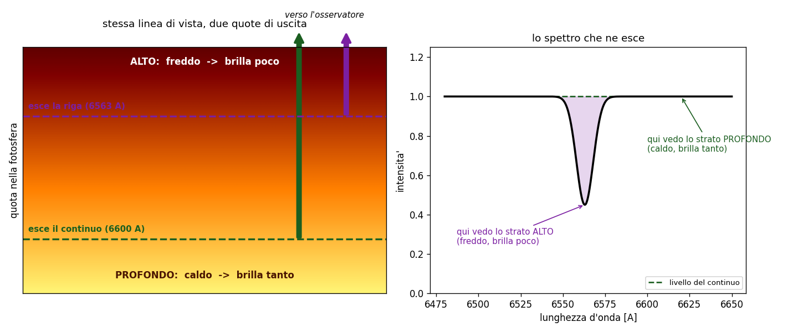
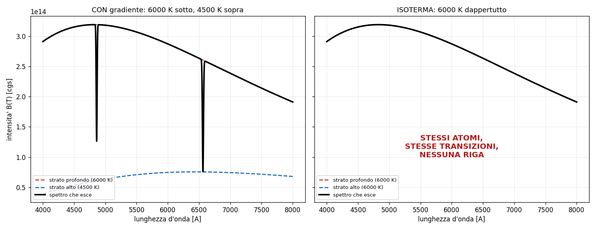

# 3 - Trasporto radiativo: perche' una riga e' scura o luminosa

**Dispensa: cap. 3 (pag. 35-40).**

_Capitolo a **mattoncini**, ed e' il piu' importante di tutti: ogni pezzo si appoggia sul
precedente, quindi non saltarne nessuno anche se sembrano ovvi._

Questo capitolo e' il piu' importante di tutti, lo dico subito. Non perche' sia difficile:
perche' e' l' unico che vale **sempre**, stelle e nebulose, righe in assorbimento e righe in
emissione. Tutto il resto del corso e' un caso particolare di quello che c'e' scritto qui.

La domanda e':

> la luce attraversa un gas. Quando esce, cos' e' cambiato?

---

## 1. Le due sole cose che possono succedere

Prendi un raggio di intensita' $I$ e mandalo dentro uno straterello di gas spesso $ds$. Ci sono due
cose che possono succedere, e solo due:

1. **il gas si mangia un po' di luce** (assorbimento)
2. **il gas ci aggiunge un po' di luce** (emissione)

Scritto:

$$\frac{dI}{ds} = -k I + \varepsilon$$

$k$ $\quad$ coefficiente di assorbimento, quanto il gas e' bravo a mangiare. Nota che moltiplica
$I$: piu' luce arriva, piu' ne viene tolta (togliere il 10% di tanto e' tanto).

$\varepsilon$ $\quad$ emissivita', quanta luce il gas ci mette di suo. Non moltiplica $I$: il gas
emette per conto suo, che tu gli mandi luce o no.

_**Attenzione:** tutta l' asimmetria del problema sta qui. L' assorbimento e'
proporzionale a quello che c'e', l' emissione no. Da questa differenza esce tutto il resto._

---

## 2. Primo trucco: mettere insieme i due coefficienti

L' equazione cosi' com' e' ha due coefficienti scomodi. Si raccoglie $k$:

$$\frac{dI}{ds} = -k \left( I - \frac{\varepsilon}{k} \right)$$

e si da' un nome a quel rapporto, che si chiama **funzione sorgente**:

$$S \equiv \frac{\varepsilon}{k}$$

quindi

$$\frac{dI}{ds} = -k (I - S)$$

---

### 2.1 Che cos'è $S$, in parole

$S$ e' il rapporto fra quanto il gas emette e quanto assorbe. Dimensionalmente e' un' intensita', e
si legge cosi':

> $S$ e' l' intensita' verso cui il gas sta cercando di portare la radiazione.

Guarda l' equazione: se $I$ e' piu' grande di $S$, la derivata e' negativa e $I$ **cala**. Se $I$ e'
piu' piccola di $S$, la derivata e' positiva e $I$ **cresce**. Se sono uguali, non succede niente.

**Il gas tira sempre $I$ verso $S$.**

---

### 2.2 Il criterio generale (da qui esce tutto il corso)

| se | vedi |
|---|---|
| $I > S$ | **assorbimento** (riga scura) |
| $I < S$ | **emissione** (riga luminosa) |
| $I = S$ | **niente riga** |

_**Occhio a questo:** questo e' il criterio generale, e non dipende da niente. Non
dipende dal fatto che tu stia guardando una stella o una nebulosa, non dipende dalla temperatura,
non dipende dalla densita'. Se ti ricordi solo una cosa di tutto il corso, ricordati questa: che
tipo di riga vedi dipende dal confronto fra la luce che arriva e la funzione sorgente del gas._

---

## 3. Secondo trucco: misurare il cammino in modo furbo

Dire "lo strato e' spesso un metro" non serve a niente, perche' dipende da quanto e' denso e da
quanto assorbe. Quello che conta e' **quanto assorbimento c'e' lungo il cammino**. Quindi si
cambia variabile:

$$d\tau = k \, ds$$

$\tau$ si chiama **profondita' ottica** ed e' adimensionale. Non misura una distanza: misura
quanto e' opaco il cammino.

| $\tau$ | come si dice | quanta luce passa |
|---|---|---|
| $\tau \ll 1$ | **otticamente sottile** | quasi tutta |
| $\tau = 1$ | - | il **37%** ($1/e$) |
| $\tau \gg 1$ | **otticamente spesso** | quasi niente |

_**Attenzione:** otticamente sottile vuol dire $\tau \ll 1$. Il numero $2/3$ che si incontra piu'
avanti e' un' altra cosa: e' la profondita' a cui si definisce la fotosfera di una stella._

---

## 4. La soluzione

Con $\tau$ al posto di $s$, l' equazione si integra e viene:

$$I = I_0 e^{-\tau} + S (1 - e^{-\tau})$$

$I_0 e^{-\tau}$ $\quad$ **quello che resta** della luce di partenza: attenuato esponenzialmente

$S(1 - e^{-\tau})$ $\quad$ **quello che il gas ci ha messo di suo**

---

### 4.1 Leggerla nei casi limite

E' una media pesata fra $I_0$ e $S$, e il peso e' $e^{-\tau}$.

**Se $\tau \to 0$** (gas trasparente): $e^{-\tau} \to 1$, quindi $I \to I_0$. Non e' cambiato
niente, la luce passa e basta.

**Se $\tau \to \infty$** (gas opaco): $e^{-\tau} \to 0$, quindi $I \to S$. **Ti sei dimenticato
completamente di $I_0$**: qualunque cosa ci fosse dietro, tu vedi solo il gas.

_**Vale la pena dirlo:** questo secondo caso e' il motivo per cui esiste il concetto di
fotosfera. Guardando una stella non vedi il centro: vedi lo strato dove $\tau$ diventa circa 1
(per convenzione $2/3$), perche' tutto quello che sta sotto e' schermato. La "superficie" di una
stella e' semplicemente la profondita' a cui il gas smette di essere trasparente._

---

## 5. Quando $S$ diventa Planck

Fin qui $S$ e' solo un rapporto fra due coefficienti. Ma se il gas e' in **equilibrio
termodinamico locale (LTE)**, cioe' se le collisioni sono cosi' frequenti da imporre a tutto quanto
la stessa temperatura $T$, allora vale la legge di Kirchhoff e viene fuori questa:

$$S = B_\nu(T)$$

cioe' la funzione sorgente diventa il **corpo nero** a quella temperatura.

**Questa uguaglianza vale solo in LTE.** Nelle nebulose non vale, ed e' esattamente per quello che
le nebulose si comportano in modo cosi' diverso.

---

## 6. Il caso delle stelle: perché le righe sono scure

Adesso mettiamo insieme i pezzi e rispondiamo alla domanda vera.

Siamo in una fotosfera stellare, densa, in LTE, quindi $S = B(T)$. La temperatura **cala** salendo
verso l' esterno.

Il punto e' questo: il coefficiente di assorbimento $k$ **non e' lo stesso a tutte le lunghezze
d' onda**. Alla lunghezza d' onda di una riga il gas assorbe molto di piu':

$$k_{riga} \gg k_{continuo}$$

Conseguenza diretta: $\tau$ arriva a 1 **prima**, cioe' piu' in alto.

- **nel continuo** (fuori dalla riga): vedi fino in fondo, uno strato profondo e **caldo**
- **dentro la riga**: ti fermi molto prima, in uno strato alto e **freddo**

E siccome $S = B(T)$ e $B$ cresce con $T$, lo strato freddo emette **meno**. Quindi dentro la riga
arriva meno luce che nel continuo: **la riga e' scura**.

---

### 6.1 La cosa che chiude il ragionamento

E qui ne segue una cosa che secondo me e' il modo migliore di verificare se hai capito davvero
questo capitolo:

> **senza un gradiente di temperatura non esiste nessuna riga.**

Se la fotosfera fosse isoterma, tutti gli strati avrebbero la stessa $S$, e non importerebbe da
quale profondita' ti arriva la luce: vedresti sempre la stessa intensita'. Spettro liscio, nessuna
riga, ne' scura ne' luminosa.

**Le righe non le fa il gas: le fa il gradiente.** Il gas decide solo a che lunghezza d' onda
succede.

---

## 7. Il caso delle nebulose: perché le righe sono luminose

Stesso identico criterio, situazione rovesciata.

Guardi una nebulosa. Alle sue spalle non c'e' niente: **$I_0 \approx 0$**, e il fondo cielo e'
buio. Il gas invece emette, quindi $S > 0$.

Quindi $I < S$, e per il criterio del punto 2.2 vedi **emissione**.

E siccome il gas e' rarefatto, $\tau \ll 1$ nelle righe: tutti i fotoni prodotti escono senza
essere riassorbiti. Questo semplifica moltissimo la vita, e ci si torna nel
[capitolo 5.5](c055_ricombinazione.md).

---

### 7.1 Lo stesso gas, due risposte diverse

Su questo fermiamoci un secondo.

Non e' che le nebulose siano fatte di roba diversa dalle stelle. E' lo stesso idrogeno. Quello che
cambia e' **cosa c'e' dietro**:

| | cosa c'e' dietro | $I_0$ | risultato |
|---|---|---|---|
| fotosfera | strati piu' caldi e profondi | grande | $I > S$ -> assorbimento |
| nebulosa | spazio vuoto | ~0 | $I < S$ -> emissione |

Se metti una nube di gas **davanti** a una stella la vedi in assorbimento, se la metti **di fianco**
la vedi in emissione. Stessa nube.

---

## 8. In breve

- $dI/ds = -kI + \varepsilon$: solo due cose possono succedere, si toglie luce o se ne aggiunge
- $S = \varepsilon/k$ e' l' intensita' verso cui il gas tira la radiazione
- criterio generale: $I > S$ assorbimento, $I < S$ emissione, $I = S$ niente riga
- $\tau$ misura l' opacita' del cammino, non la distanza. $\tau = 1$ -> passa il 37%
- $I = I_0 e^{-\tau} + S(1 - e^{-\tau})$: media pesata fra quello che entra e quello che il gas
  vorrebbe
- $S = B(T)$ **solo in LTE**
- nelle stelle le righe sono scure perche' dentro la riga vedi uno strato piu' alto e piu' freddo
- **senza gradiente di temperatura non c'e' nessuna riga**
- nelle nebulose sono luminose perche' dietro non c'e' niente

---

## Domande tattiche

**1.** Hai una nube di gas e una stella. Come devi disporle per vedere le righe in assorbimento?
E per vederle in emissione? La nube e' sempre la stessa. (-> sezioni 2.2 e 7.1)

**2.** Una fotosfera perfettamente isoterma: che spettro produce? Rispondi ragionando su $S$, non
a memoria. (-> sezione 6.1)

**3.** Perche' guardando il Sole non vedi il suo centro? La risposta sta in una formula sola.
(-> sezione 4.1)

**4.** Dentro una riga il gas assorbe molto di piu' che nel continuo. Come mai questo la rende
**scura** e non luminosa? Fai il percorso completo, sono tre passaggi. (-> sezione 6)

**5.** In che condizioni puoi scrivere $S = B(T)$? E cosa succede se lo fai in una nebulosa?
(-> sezione 5)
