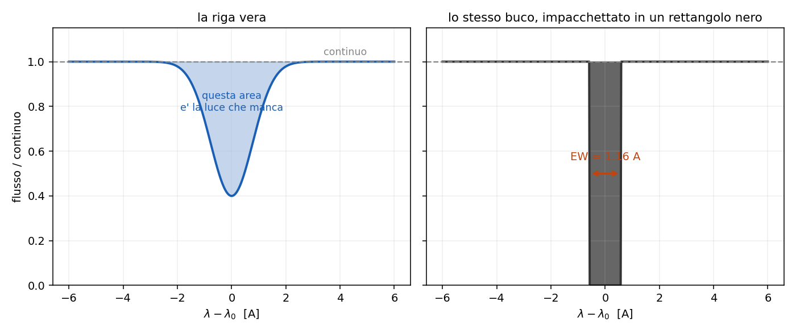
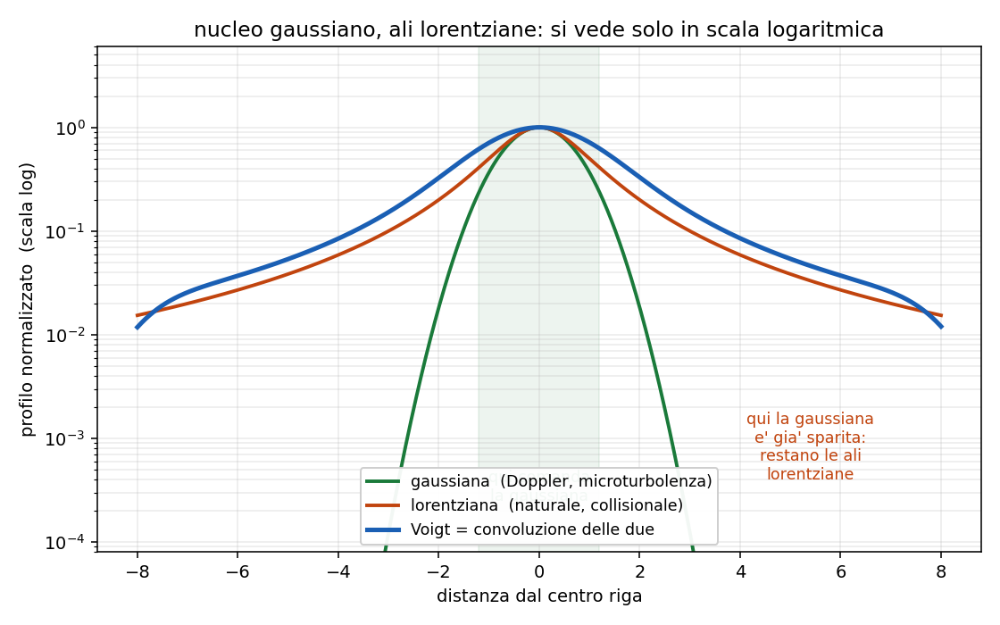

# 4 - Righe in assorbimento: quanto e' forte e quanto e' larga

**Dispensa: cap. 4 (pag. 41-52).**

_Capitolo a **mattoncini**. Non c'e' un ragionamento unico da difendere: ci sono sei o sette cose
diverse da posare una sull' altra, e si prendono una per volta._

Dal [capitolo 3](c03_trasporto.md) sappiamo **perche'** in una stella le righe sono scure. Adesso
le guardiamo da vicino, e ci sono due domande diverse da fare, che vanno tenute ben separate:

1. **quanta luce manca?** $\rightarrow$ larghezza equivalente (EW)
2. **quanto e' larga la riga?** $\rightarrow$ FWHM e i meccanismi di allargamento

Sono due cose indipendenti. Una riga puo' togliere tanta luce restando stretta, oppure toglierne
poca essendo larghissima.

---

## 1. Quanta luce manca

Voglio un numero che dica quanto una riga e' forte. Ma quale numero?

La **profondita'** del minimo non va bene: dipende da quanto e' larga la riga e soprattutto da
quanto e' buono lo spettrografo. Uno strumento con poca risoluzione mi spalma la riga e me la fa
sembrare meno profonda, pur essendo la stessa identica riga.

Serve una misura che sia **robusta rispetto allo strumento**.

---

### 1.1 L'idea

Invece di misurare quanto e' profonda, misuro **quanta luce manca in totale**: prendo tutta l' area
fra il continuo e la riga.

$$EW = \frac{1}{\bar{I_c}} \int_{\lambda_1}^{\lambda_2} \left( \bar{I_c} - I_\lambda \right) d\lambda$$

$\bar{I_c}$ $\quad$ il livello del continuo, cioe' quanta luce ci sarebbe se la riga non ci fosse.
Si misura facendo la media dei punti a destra e a sinistra della riga.

$(\bar{I_c} - I_\lambda)$ $\quad$ quanto manca, punto per punto

$\lambda_1, \lambda_2$ $\quad$ dove decido io che la riga comincia e finisce

Dividendo per il continuo il risultato viene in **Angstrom**, ed e' un' area normalizzata.

---

### 1.2 Perché si chiama "larghezza"

Il nome viene da come si legge il risultato:

> la EW e' la larghezza di un rettangolo **completamente nero**, alto quanto il continuo, che
> toglierebbe esattamente la stessa quantita' di luce della riga vera.

Cioe': prendo tutta la luce che manca, sparsa su un profilo che sale e scende, e la impacchetto in
un rettangolo. La base di quel rettangolo e' la EW.

_**Nota subito così de botto:** ecco perche' e' robusta. Se lo strumento mi allarga la riga, la
riga diventa piu' bassa ma anche piu' larga, e **l' area non cambia**. La EW misura una proprieta'
del gas, non dello spettrografo._

---

### 1.3 Come si calcola sui dati

Nella pratica lo spettro e' un vettore di numeri, quindi l' integrale diventa una somma:

$$EW = \frac{\sum_i \left( \bar{I_c} - I_i \right) \Delta\lambda}{\bar{I_c}}$$

$\Delta\lambda$ $\quad$ il passo di campionamento dello spettro

---

### 1.4 Esempio numerico

Ho questo vettore di flusso, con passo $\Delta\lambda = 1$ A:

$$100 \quad 100 \quad 60 \quad 40 \quad 60 \quad 100 \quad 100$$

Decido che la riga va dall' indice 2 (il primo 60) all' indice 4 (il secondo 60).

**Il continuo**: media dei punti fuori dalla riga

$$\bar{I_c} = \frac{100 + 100 + 100 + 100}{4} = 100$$

**Quello che manca**: punto per punto, quanto sta sotto il continuo

$$(100-60) + (100-40) + (100-60) = 40 + 60 + 40 = 140$$

**La EW**:

$$EW = \frac{140}{100} \times 1 \, \unicode{xC5} = 1.4 \; \unicode{xC5}$$

Vuol dire: quella riga toglie la stessa luce che toglierebbe una banda nera larga 1.4 A.

---

## 2. Quanto e' larga

Una riga non e' mai una linea sottile: ha sempre una larghezza. La misura che si usa e' la
**FWHM**, la larghezza a meta' altezza.

La domanda e': da dove viene quella larghezza?

E' una domanda che si ribalta subito: **misurando la larghezza si
risale alle proprieta' del gas**. E' cosi' che si misurano temperature, densita' e velocita' di
rotazione di stelle che non vedremo mai da vicino.

_**Attenzione a non confonderla con la EW:** la EW dice quanta luce manca, la FWHM dice quanto e'
larga la riga. Sono due misure diverse che non si implicano a vicenda._

---

### 2.1 I cinque meccanismi, in colpo d'occhio

Sono cinque e vanno imparati come lista chiusa. Prima la struttura, poi uno per uno:

| | meccanismo | profilo |
|---|---|---|
| due **lorentziani** | naturale, collisionale | picco stretto, ali larghe |
| due **gaussiani** | Doppler termico, microturbolenza | campana, ali che crollano |
| uno **geometrico** | rotazionale | semiellisse |

---

### 2.2 Allargamento naturale (lorentziano)

E' l' unico che c'e' **sempre**, anche con un singolo atomo fermo e isolato nel vuoto.

Un livello eccitato ha vita media finita, $\Delta t \simeq 1/A$. Per il principio di
indeterminazione, un livello che dura poco ha un' energia mal definita:

$$\Delta E \, \Delta t \simeq \hbar \quad \rightarrow \quad \Delta \nu = \frac{1}{2 \pi \Delta t}$$

Il classico dice la stessa cosa: l' atomo e' un **oscillatore smorzato**, l' onda che emette non
dura per sempre ma si spegne con costante di tempo $\tau = 1/A$, e un treno d' onda che non dura
per sempre non ha una frequenza sola.

$$\text{FWHM}(\lambda) \simeq 1.18 \times 10^{-4} \; \unicode{xC5}$$

_**Occhio:** in lunghezza d' onda viene un numero **costante**, che non dipende
da quale riga stai guardando. Ed e' piccolissimo: $10^{-4}$ A e' il piu' piccolo di tutti, non lo
risolvi mai in uno spettro astrofisico. C'e' sempre, ma non lo vedi mai da solo._

Collegamento in avanti: un livello **metastabile** ha $A$ piccolissimo, quindi vita lunghissima,
quindi riga naturale ancora piu' stretta. Vedi il [capitolo 5.7](c057_righe_proibite.md).

---

### 2.3 Doppler termico (gaussiano)

Gli atomi del gas si agitano. Ognuno emette alla sua frequenza esatta, ma si sta muovendo rispetto
a me, quindi io la vedo spostata:

$$\nu = \nu_0 \left( 1 + \frac{v}{c} \right)$$

Chi viene verso di me la manda nel blu, chi scappa nel rosso. Siccome le velocita' seguono
Maxwell-Boltzmann, la riga risultante e' una **gaussiana**:

$$v_{th} = \sqrt{\frac{2 k_B T}{m}}$$

**Va come $\sqrt{T/m}$: caldo allarga, pesante stringe.**

| dove | elemento | $v_{th}$ |
|---|---|---|
| Sole, $T \simeq 5800$ K | idrogeno | ~9.8 km/s |
| nebulosa, $T \simeq 10^4$ K | idrogeno | **~13 km/s** |
| nebulosa, $T \simeq 10^4$ K | ferro ($A=56$) | 13/$\sqrt{56}$ ~ 1.7 km/s |

Per passare da un elemento all' altro basta **dividere per $\sqrt{A}$**.

---

### 2.4 Microturbolenza (gaussiano)

Stessa geometria del Doppler termico, ma quello che si muove non e' il singolo atomo: sono
**celle di gas intere**, piu' piccole del libero cammino medio del fotone. Il fotone attraversa la
cella e la vede muoversi tutta insieme.

Anche questa e' gaussiana, e si somma al termico **in quadratura**:

$$\Delta \nu = \frac{\nu_0}{c} \sqrt{\frac{2 k_B T}{m} + v_{turb}^2}$$

_**In pratica:** la microturbolenza **non dipende dalla massa**, perche' a muoversi
e' la cella intera e non l' atomo. E la cosa serve, perche' e' cosi' che si separano i due
contributi. Se guardo due elementi di massa molto diversa nello stesso spettro, il termico li
allarga in modo diverso e la turbolenza li allarga uguale. Due equazioni, due incognite, e tiro
fuori sia $T$ che $v_{turb}$._

---

### 2.5 Collisionale, o di pressione (lorentziano)

Se il gas e' abbastanza denso, gli atomi si urtano. Ogni urto **tronca il treno d' onda**, che e'
esattamente la stessa fisica dell' allargamento naturale: la vita del livello si accorcia, solo che
stavolta e' l' urto ad accorciarla invece del decadimento spontaneo.

Per questo il profilo torna ad essere una **lorentziana**.

Dipende da:

- **la densita' (o pressione) del gas**: piu' urti al secondo
- la sezione d' urto del processo collisionale
- la velocita' termica

_**Da ricordare:** ecco a cosa serve. E' un misuratore di densita', e da li' esce la
classificazione delle **classi di luminosita' MK**. Una **nana** ha gravita' superficiale alta,
atmosfera densa e compatta $\rightarrow$ righe **larghe**. Una **gigante** ha atmosfera rarefatta
$\rightarrow$ le stesse righe escono **strette**. Guardando la larghezza delle righe distinguo I,
III e V a parita' di tipo spettrale._

Occhio a questo, che e' l' errore facile: l' urto **non toglie energia al fotone**. La riga resta
centrata dov' era e si allarga da tutte e due le parti. Quello che cambia e' che l' energia diventa
meno definita.

---

### 2.6 Rotazionale (semiellisse)

L' unico **geometrico**, e va capito che e' di natura diversa dagli altri quattro.

La stella ruota. Un lembo del disco viene verso di me, l' altro scappa. Ogni singolo punto della
superficie emette una riga **stretta**, solo spostata di un po'. Il fatto e' che io il disco
stellare **non lo risolvo**: mi arriva tutto sommato in un unico spettro, e la somma di tante righe
strette spostate diversamente e' una riga larga.

$$\frac{\Delta\lambda}{\lambda}\bigg|_{max} = \frac{V \sin i}{c}$$

$V$ $\quad$ velocita' di rotazione all' equatore

$i$ $\quad$ angolo fra l' asse di rotazione e la linea di vista

Il $\sin i$ c'e' perche' l' inclinazione dell' asse non la conosco: se la stella la vedo **di
polo** ($i = 0$) la rotazione non allarga niente, perche' nessun punto si avvicina o si allontana.
Quindi non misuro mai $V$, misuro sempre e solo $V \sin i$.

Il profilo e' una **semiellisse**, e viene fuori dal fatto che l' intensita' di ogni striscia
verticale del disco e' proporzionale alla lunghezza della corda.

| tipo | $V \sin i$ |
|---|---|
| O, B, A | 100-200 km/s |
| F | ~50 km/s |
| G | ~10 km/s |
| Sole | ~2 km/s |
| Be/Oe peculiari | 250-400 km/s |

---

## 3. Mettendoli insieme: il profilo di Voigt

Nella realta' ci sono tutti insieme, e il profilo osservato e' la **convoluzione** dei gaussiani
coi lorentziani. Si chiama **profilo di Voigt**, e ha una forma caratteristica:

> **nucleo gaussiano, ali lorentziane.**

---

### 3.1 Perché viene fuori proprio così

Basta guardare come le due funzioni vanno a zero allontanandosi dal centro:

$$\phi_{gauss} \propto e^{-\Delta^2} \qquad \qquad \phi_{lorentz} \propto \Delta^{-2}$$

L' esponenziale crolla molto piu' in fretta di una potenza.

**Vicino al centro**: la gaussiana e' grossa e detta lei la forma.
**Lontano dal centro**: la gaussiana e' gia' sparita, e restano solo le ali lorentziane a reggere.

---

### 3.2 Righe forti: il centro satura

Una cosa pratica da tenere a mente: nelle righe molto forti il centro **si
satura**, cioe' e' gia' completamente nero e non puo' andare piu' giu'.

Quindi se aggiungo altri atomi assorbenti, la riga non puo' piu' approfondirsi: cresce **in
larghezza**, cioe' crescono le ali lorentziane. E' il regime in cui la EW smette di essere
proporzionale al numero di atomi e ricomincia a crescere solo lentamente.

---

## 4. In breve

Sulla EW:

- misura **quanta luce manca**, in Angstrom, ed e' l' area normalizzata della riga
- si legge come la larghezza di un rettangolo nero che toglie la stessa luce
- e' robusta rispetto allo strumento, perche' allargando la riga l' area non cambia

Sugli allargamenti:

| meccanismo | causa | profilo | dipende da |
|---|---|---|---|
| naturale | vita media finita, Heisenberg | lorentziano | $A$; ~$10^{-4}$ A, il piu' piccolo |
| Doppler termico | agitazione termica | gaussiano | $\sqrt{T/m}$; H a $10^4$ K = 13 km/s |
| microturbolenza | celle di gas | gaussiano | $v_{turb}$, **non** dalla massa |
| collisionale | urti che troncano il treno d' onda | lorentziano | **densita'** $\rightarrow$ classi MK |
| rotazionale | rotazione della stella | semiellisse | $V \sin i / c$, unico geometrico |

- i due lorentziani sono **la stessa fisica**: vita del livello accorciata, una volta dalla natura e
  una volta dagli urti
- i due gaussiani si sommano **in quadratura** e si distinguono perche' solo il termico dipende
  dalla massa
- Voigt = nucleo gaussiano, ali lorentziane, perche' $e^{-\Delta^2}$ crolla prima di $\Delta^{-2}$

---

## Domande tattiche

**1.** Prendi lo stesso spettro e riosservalo con uno spettrografo peggiore, che risolve meno.
La EW cambia? E la FWHM? (-> sezioni 1.2 e 2)

**2.** In una stella misuri la riga dell' idrogeno e quella del ferro. La riga dell' idrogeno e'
molto piu' larga. Puoi concludere che l' idrogeno e' piu' caldo del ferro? (-> sezione 2.3)

**3.** Due stelle hanno lo stesso tipo spettrale, ma una ha le righe nettamente piu' larghe.
Quali due spiegazioni diverse ti vengono in mente, e come faresti a distinguerle? (-> sezioni 2.5 e 2.6)

**4.** Ti dicono: "l' urto sposta la riga verso il rosso perche' il fotone perde energia". Dov' e'
l' errore? (-> sezione 2.5)

**5.** Guardi due elementi di massa molto diversa nello stesso spettro e trovi che si allargano
esattamente uguale. Cosa vuol dire? (-> sezione 2.4)

**6.** Una riga e' fortissima e il suo centro e' completamente nero. Aggiungi altri atomi
assorbenti sul cammino. Cosa cambia nel profilo, e perche' proprio li'? (-> sezioni 3.1 e 3.2)
