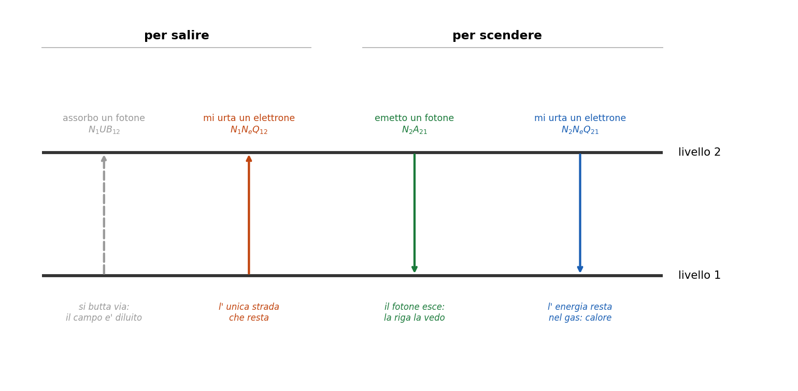
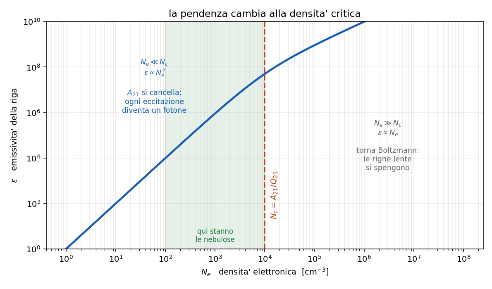

# 5.1-5.4 - Gas rarefatto: atomo a due livelli, densita' critica, quenching

**Dispensa: cap. 5.1-5.4 (pag. 53-63).**

_Capitolo a **mattoncini**. Si costruisce un bilancio pezzo per pezzo, e poi lo si legge nei
due casi limite: e' li' che sta tutto il capitolo._

Da qui in poi si cambia mondo: si lascia la fotosfera e si va nelle nebulose. La temperatura e'
quasi la stessa ($\sim 10^4$ K), ma la densita' crolla di **dieci ordini di grandezza**.

E la prima conseguenza e' pesante: **Boltzmann non vale piu'**.

Boltzmann descrive un gas in cui le collisioni sono cosi' frequenti da imporre l' equilibrio. In
una nebulosa le collisioni sono rarissime. Quindi le popolazioni dei livelli **vanno calcolate a
mano**, contando chi sale e chi scende.

Questo capitolo fa esattamente quel conto, nel caso piu' semplice possibile.

---

## 1. Il modello

Si prende un atomo (o uno ione: **vale per qualsiasi specie**, e il caso piu' importante non e'
affatto l' idrogeno) e si finge che abbia **due soli livelli**: uno basso dove sta di solito, e uno
alto dove puo' salire.

Perche' si puo' fare una semplificazione cosi' brutale?

1. perche' semplifica i conti, e questo e' onesto dirlo
2. perche' in quelle condizioni **e' quasi vero**: a $10^4$ K l' energia tipica e' 0.86 eV, quindi
   di livelli davvero raggiungibili ce n'e' pochissimi. Gli altri stanno troppo in alto.

In pratica: un livello in cui l' atomo sta, uno in cui puo' salire, e **una sola riga** che nasce
dalla transizione fra i due.

---

## 2. I modi per salire e per scendere

Adesso si contano i processi. Sono quattro in tutto, due che portano su e due che portano giu'.

### 2.1 Per salire da 1 a 2

**Assorbo un fotone** di energia esatta $h\nu = E_2 - E_1$: si conta come $N_1 U B_{12}$.

**Mi urta un elettrone libero** abbastanza energetico, che mi cede energia: si conta come
$N_1 N_e Q_{12}$.

$N_1$ $\quad$ densita' numerica di atomi sul livello 1

$N_e$ $\quad$ densita' numerica di elettroni liberi

$Q_{12}$ $\quad$ rate collisionale di eccitazione, in cm$^3$ s$^{-1}$

$U B_{12}$ $\quad$ rate radiativo, dipende dal campo di radiazione $U$

_**Da tenere:** il termine radiativo $U B_{12}$ **si butta via**. In una nebulosa
la stella e' lontanissima, il campo di radiazione arrivato li' e' **diluito** di un fattore
enorme, e i fotoni giusti per quella transizione praticamente non passano. Quindi resta solo il
canale collisionale: **in una nebulosa si sale solo per urto.**_

---

### 2.2 Per scendere da 2 a 1

**Emetto un fotone**: si conta come $N_2 A_{21}$.

**Cedo la mia energia a un elettrone che passa** (urto di seconda specie, o superelastico): si
conta come $N_2 N_e Q_{21}$.

$A_{21}$ $\quad$ coefficiente di Einstein, probabilita' di decadere spontaneamente al secondo

$Q_{21}$ $\quad$ rate collisionale di diseccitazione

**Questa e' la biforcazione centrale di tutto il capitolo**, quindi fermiamoci un attimo:

| come scendo | cosa succede all' energia |
|---|---|
| emetto un fotone | **esce dalla nebulosa e la vedo** |
| mi urta un elettrone | **resta nel gas come calore, non la vedo** |

Tutto quello che segue e' capire quale dei due vince.

---

## 3. L'equazione di equilibrio statistico

Una nebulosa cambia su scale di migliaia di anni, mentre i processi atomici avvengono in frazioni
di secondo. Quindi, sui tempi che ci interessano, la situazione e' **stabile**: il numero di atomi
che salgono deve pareggiare quello di chi scende.

$$(\text{quelli che salgono}) = (\text{quelli che scendono})$$

$$N_1 N_e Q_{12} = N_2 A_{21} + N_2 N_e Q_{21}$$

Da cui si ricava il rapporto fra le popolazioni:

$$\frac{N_2}{N_1} = \frac{N_e Q_{12}}{A_{21} + N_e Q_{21}}$$

_**Qui si nota una cosa:** questa formula sostituisce Boltzmann. Boltzmann diceva che il
rapporto fra due popolazioni dipende solo dalla temperatura. Qui invece dipende **anche dalla
densita'**, perche' $N_e$ compare sia sopra che sotto e non si semplifica. E' la firma del fatto
che non siamo in equilibrio._

---

### 3.1 Come si legge il denominatore

I due termini di sotto sono le **due strade per svuotare il livello 2**.

$A_{21}$ $\quad$ svuotamento per emissione, e **non dipende dalla densita'**: e' una proprieta'
dell' atomo

$N_e Q_{21}$ $\quad$ svuotamento per urto, e **cresce con la densita'**

Quale dei due comanda dipende da quanto e' denso il gas. Ed e' l' unica domanda che conta.

---

## 4. La densità critica

Domanda naturale, ed e' quella giusta da farsi:

> a che densita' i due si pareggiano?

Si impone $A_{21} = N_e Q_{21}$ e si tira fuori quella densita', che si chiama **densita' critica**:

$$N_c = \frac{A_{21}}{Q_{21}}$$

$N_c$ e' la densita' alla quale un atomo eccitato ha **la stessa probabilita'** di decadere
emettendo un fotone o di essere spento da un urto.

**Ogni transizione di ogni ione ha la sua $N_c$.** Non e' un numero universale: dipende da $A_{21}$,
cioe' da quanto quella transizione e' veloce.

---

## 5. Primo regime: gas rarefatto ($N_e \ll N_c$)

Qui $N_e Q_{21}$ e' trascurabile davanti ad $A_{21}$, quindi:

$$\frac{N_2}{N_1} = \frac{N_e Q_{12}}{A_{21}}$$

Adesso il passaggio bello. L' emissivita' della riga e' "quanti decadimenti al secondo per
cm$^3$", cioe':

$$\varepsilon \propto N_2 A_{21}$$

Sostituendo $N_2$ trovato sopra:

$$\varepsilon = N_1 N_e Q_{12}$$

**$A_{21}$ si è cancellato.**

---

### 5.1 Cosa vuol dire che $A_{21}$ sparisce

Questo e' il punto piu' importante di tutto il capitolo, quindi lo scrivo lento.

Se il gas e' abbastanza rarefatto, **l' intensita' della riga non dipende da quanto quella
transizione e' probabile.**

Il motivo, a pensarci, e' ovvio: se l' atomo e' salito su, prima o poi **deve** scendere, e
l' unico modo che ha e' emettere. Che ci metta $10^{-8}$ secondi o dieci secondi non cambia niente,
perche' tanto in quel tempo non lo disturba nessuno.

> **A bassa densita', ogni eccitazione diventa un fotone.**

E l' emissivita' e' governata solo da **quanto spesso si sale**, cioe' dagli urti. Siccome
$N_1 \propto N_e$ nel gas:

$$\varepsilon \propto N_e^2$$

Va col **quadrato** della densita': serve un elettrone per urtare e un atomo da urtare.

---

## 6. Secondo regime: gas denso ($N_e \gg N_c$)

Qui succede il contrario: $A_{21}$ e' trascurabile davanti a $N_e Q_{21}$, quindi

$$\frac{N_2}{N_1} = \frac{N_e Q_{12}}{N_e Q_{21}} = \frac{Q_{12}}{Q_{21}}$$

$N_e$ **si semplifica**, e resta un rapporto fra due coefficienti collisionali.

---

### 6.1 Il rapporto $Q_{12}/Q_{21}$

Quel rapporto e' noto, e viene dal **bilancio dettagliato**: in equilibrio termodinamico ogni
processo e' bilanciato esattamente dal suo inverso, quindi

$$N_1 N_e Q_{12} = N_2 N_e Q_{21} \quad \rightarrow \quad \frac{N_2}{N_1} = \frac{Q_{12}}{Q_{21}}$$

e siccome in equilibrio quel rapporto lo da' Boltzmann:

$$\frac{Q_{12}}{Q_{21}} = \frac{g_2}{g_1} e^{-h\nu / k_B T}$$

_**Nota:** questa relazione si ricava assumendo l' equilibrio, ma poi si usa
**anche fuori dall' equilibrio**, e non e' una scorrettezza. Il motivo: e' una relazione fra
**coefficienti**, non fra popolazioni. Dentro non compaiono $N_1$ ne' $N_2$. I coefficienti sono
proprieta' dell' atomo e degli elettroni che lo urtano, e l' unica cosa che serve perche' valga e'
che gli elettroni abbiano una distribuzione di velocita' maxwelliana - cosa che in una nebulosa e'
vera, perche' gli elettroni si termalizzano fra loro molto in fretta._

---

### 6.2 Il risultato

Sostituendo in $\varepsilon \propto N_2 A_{21}$:

$$\varepsilon = A_{21} N_1 \frac{g_2}{g_1} e^{-h\nu/k_B T}$$

**Siamo tornati a Boltzmann.** E stavolta $A_{21}$ **c'e'**, eccome.

Il motivo fisico: a densita' alta il livello 2 non riesce ad accumularsi oltre il valore di
equilibrio, perche' ogni urto che eccita e' pareggiato da uno che diseccita. Quindi quello che
conta e' **quanto sei veloce a emettere** prima che ti spengano.

E siccome $N_1 \propto N_e$:

$$\varepsilon \propto N_e$$

Va **lineare** con la densita', non piu' col quadrato.

---

## 7. Il quenching

Quello che succede nel regime denso ha un nome: **quenching**, cioe' spegnimento.

> l' atomo viene eccitato per urto, ma prima che faccia in tempo a emettere il fotone arriva un
> secondo urto che gli riprende l' energia. Il fotone non viene mai emesso, e l' energia resta nel
> gas come calore.

E' esattamente il motivo per cui certe righe si vedono nelle nebulose e non si vedono in
laboratorio: in laboratorio non si riesce a fare il vuoto abbastanza spinto.

---

## 8. Il quadro completo

| | $N_e \ll N_c$ | $N_e \gg N_c$ |
|---|---|---|
| chi svuota il livello 2 | l' emissione | gli urti |
| $A_{21}$ nella formula | **sparisce** | **compare** |
| chi comanda | quanto spesso si sale | Boltzmann |
| $\varepsilon$ va come | $N_e^2$ | $N_e$ |
| destino dell' energia | esce come fotone | resta come calore |
| le righe lente (proibite) | **si vedono** | **si spengono** |

---

### 8.1 Perché questo capitolo spiega le righe proibite

Ed ecco a cosa serviva tutto il discorso.

Una riga **proibita** e' una riga con $A_{21}$ ridicolmente piccolo, tipo $10^{-2}$ s$^{-1}$ contro
i $10^8$ di una riga normale. Guardando la tabella:

- **ad alta densita'**: l' emissivita' dipende da $A_{21}$, che e' minuscolo -> la riga non si vede
- **a bassa densita'**: $A_{21}$ **non compare nella formula** -> alla riga non gliene importa
  niente di essere lenta, e si vede benissimo

E c'e' anche il verso quantitativo: $N_c = A_{21}/Q_{21}$, quindi una riga con $A_{21}$ piccolo ha
$N_c$ **bassissima**, cioe' basta pochissima densita' per spegnerla.

Se ne parla per bene nel [capitolo 5.7](c057_righe_proibite.md).

---

## 9. In breve

- nelle nebulose Boltzmann non vale: le popolazioni si contano a mano con l' equilibrio statistico
- si sale **solo per urto**, perche' il campo di radiazione e' diluito
- si scende in due modi: emettendo (**la vedo**) o per urto (**calore, non la vedo**)
- $N_2/N_1 = N_e Q_{12} / (A_{21} + N_e Q_{21})$
- $N_c = A_{21}/Q_{21}$ e' la densita' a cui i due modi di scendere si pareggiano
- $N_e \ll N_c$: $A_{21}$ **si cancella**, $\varepsilon = N_1 N_e Q_{12} \propto N_e^2$, ogni
  eccitazione diventa un fotone
- $N_e \gg N_c$: torna Boltzmann, $\varepsilon \propto N_e$, le righe lente si spengono
  (**quenching**)
- $Q_{12}/Q_{21} = (g_2/g_1) e^{-h\nu/k_BT}$, dal bilancio dettagliato, e vale anche fuori
  equilibrio perche' lega **coefficienti** e non popolazioni

---

## Domande tattiche

**1.** In una nebulosa, un atomo puo' salire di livello in due modi. Perche' se ne butta via uno?
(-> sezione 2.1)

**2.** A bassa densita' l' emissivita' della riga non dipende da $A_{21}$. Spiega perche' con una
frase che parli dell' atomo, senza usare la formula. (-> sezione 5.1)

**3.** La relazione $Q_{12}/Q_{21} = (g_2/g_1)e^{-h
u/k_BT}$ si ricava assumendo l' equilibrio, ma
poi la usiamo fuori dall' equilibrio. Perche' non e' una scorrettezza? (-> sezione 6.1)

**4.** Ti danno due nebulose identiche tranne che per la densita': una a $10^2$ e una a $10^7$
cm$^{-3}$. In quale vedi la riga proibita, e di quanto cresce l' emissivita' se raddoppi la
densita' in ciascuna? (-> sezioni 5.1, 6.2 e 8)

**5.** Nel regime denso ritrovi Boltzmann. Non e' strano, visto che eravamo partiti dicendo che in
nebulosa Boltzmann non vale? Sistema la contraddizione. (-> sezione 6.2)

**6.** Una riga ha $N_c = 10^6$ cm$^{-3}$ e un' altra $N_c = 10^2$. Quale delle due ha
l' $A_{21}$ piu' grande, e come lo sai? (-> sezione 4)
