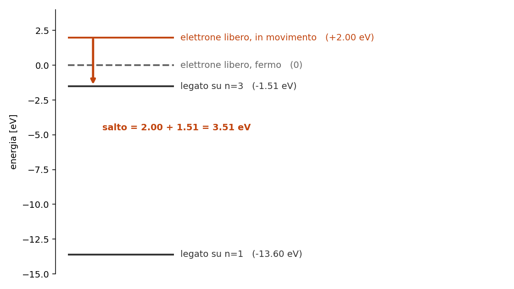

# 5.5 - Righe di ricombinazione otticamente sottili

**Dispensa: cap. 5.5 (pag. 63-66).**

_Capitolo a **mattoncini** nella prima meta' (il fotone di cattura e' un punto in cui e'
facile incartarsi), poi si tira dritto fino al decremento di Balmer._

Nel [capitolo 5](c051_atomo_due_livelli.md) l' atomo restava intero e l' elettrone saliva di
livello. Qui succede un' altra cosa: l' atomo e' **gia' ionizzato**, e l' elettrone e' **libero**.
Poi lo riacchiappa.

Da questo processo nascono le righe piu' importanti che si osservano in una nebulosa.

---

## 1. Cosa succede, in due passi

Uno ione cattura un elettrone libero. L' elettrone atterra su un certo livello $n$, e da li'
**scende a cascata** verso il basso, facendo vari salti.

Un fotone viene emesso in **ogni** passaggio:

1. **nella cattura**, quando l' elettrone passa da libero a legato
2. **in ogni gradino** della discesa

_**SIGNIFICATO FISICO:** qui si parla di ioni ed elettroni in generale, vale per qualsiasi
specie. Pero' sperimentalmente si guarda l' idrogeno, per tre motivi: compone il 90% degli atomi di
una nebulosa quindi le sue righe sono le piu' forti; ha un elettrone solo quindi i conti si fanno;
e le sue righe di ricombinazione cadono nel visibile._

---

## 2. Il fotone di cattura

Che energia ha il fotone emesso nella cattura? Per l' idrogeno:

$$h\nu = E_{cin} + \frac{13.6}{n^2}$$

$h\nu$ $\quad$ energia del fotone emesso

$E_{cin}$ $\quad$ energia cinetica che l' elettrone aveva **prima** di essere catturato

$\frac{13.6}{n^2}$ $\quad$ energia di legame del livello dove atterra, cioe' quanto servirebbe per
strapparlo di nuovo da li'

---

### 2.1 Perché si sommano

Perche' lo **zero** della scala di energia e' l' elettrone **libero e fermo**.

- elettrone libero che si muove: sta **sopra** zero, a $+E_{cin}$
- elettrone legato su $n$: sta **sotto** zero, a $-13.6/n^2$

Il fotone si porta via tutto il dislivello, che e' la somma dei due pezzi.

---

### 2.2 Esempio numerico

Uno ione cattura un elettrone che aveva 2 eV di energia cinetica, e l' elettrone si mette su $n=3$:

$$h\nu = 2 + \frac{13.6}{9} = 2 + 1.51 = 3.51 \; eV$$

---

### 2.3 La conseguenza: la cattura fa un continuo

$E_{cin}$ puo' valere **qualsiasi cosa**, perche' l' elettrone libero non ha livelli quantizzati:
puo' arrivare con la velocita' che gli pare.

Quindi il fotone di cattura puo' avere qualsiasi energia (sopra un minimo), e non fa una riga:
**fa un continuo**. Se ne parla nel [capitolo 6](c06_continui.md).

> **cattura -> continuo. cascata -> righe.**

Da qui in avanti ci si occupa solo della cascata.

---

## 3. Le assunzioni

Prima di scrivere l' equazione della cascata si fanno sei assunzioni. Non sono formalita': ognuna
toglie di mezzo un pezzo di fisica che in una nebulosa davvero non c'e'.

**1. Non siamo in equilibrio termodinamico.** Le collisioni sono troppo rare. Quindi Boltzmann non
si usa, e il bilancio va fatto a mano.

**2. Si trascura l' emissione stimolata.** Sarebbe: un atomo gia' eccitato viene colpito da un
fotone della sua stessa energia e ne emette un secondo identico. Serve un campo di radiazione
intenso, e qui il campo e' diluito.

**3. I livelli $n>1$ non sono popolati per collisione.** A $10^4$ K gli elettroni hanno 0.86 eV,
mentre per portare l' idrogeno su $n=3$ ne servono 12.1. Non ce la fanno proprio.

**4. Tutti gli atomi che vengono ionizzati stavano sul fondamentale.** Conseguenza della 3: se
nessuno e' eccitato, chi viene ionizzato parte per forza da $n=1$.

**5. Siamo in equilibrio statistico.** Le popolazioni non cambiano nel tempo: i processi atomici
sono velocissimi, la nebulosa cambia su scale di migliaia di anni.

**6. Un livello $n$ si popola solo per ricombinazione diretta o come gradino di una cascata.** Non
ci sono altre strade.

---

## 4. L'equazione

Con quelle assunzioni, per ogni livello $n$ si scrive:

$$(\text{quello che popola } n) = (\text{quello che spopola } n)$$

$$N_e N_p \alpha_n + \sum_{m>n}^{\infty} N_m A_{mn} = N_n \sum_{k<n}^{1} A_{nk}$$

$N_e N_p \alpha_n$ $\quad$ le **ricombinazioni dirette** su $n$: serve un elettrone e un protone che
si incontrino, da cui il prodotto

$\sum_{m>n} N_m A_{mn}$ $\quad$ le **cascate dall' alto**: tutti quelli che stanno sopra e scendono
su $n$

$N_n \sum_{k<n} A_{nk}$ $\quad$ le **partenze**: tutti quelli che stanno su $n$ e se ne vanno piu'
in giu'

---

### 4.1 Perché non si risolve a mano

Guardiamo il secondo termine: per sapere quanti atomi ci sono su $n$, devo sapere quanti ce ne sono su
tutti i livelli **sopra**. E per sapere quello, devo sapere quanti ce ne sono ancora piu' sopra.

E' un **sistema infinito di equazioni accoppiate**, ognuna che dipende da quelle di sopra. Chi
programma lo riconosce subito: e' un loop di dipendenze che non si chiude mai.

Quindi si tronca a un $n$ massimo ragionevole e si risolve **numericamente**, al calcolatore.

---

### 4.2 Il risultato: $\alpha_{eff}$

Il punto e' che il risultato di quel conto non serve rifarlo ogni volta: si fa una volta, si
tabula, e si usa. Il pacchetto che ne esce si chiama **coefficiente di ricombinazione efficace**:

$$\alpha_{eff}(\text{riga}, T_e) \qquad [\text{cm}^3 \text{s}^{-1}]$$

Si legge come una funzione con due argomenti e un valore di ritorno:

**in ingresso:**

$riga$ $\quad$ quale transizione di quale ione (H$\alpha$, H$\beta$, ...)

$T_e$ $\quad$ la temperatura elettronica del gas

**in uscita:** quanti fotoni **di quella riga** vengono prodotti in media per ogni ricombinazione.

_**Nota subito così de botto:** tutta la complicazione del sistema infinito e' finita li' dentro.
Non e' una scorciatoia: e' che il conto e' stato fatto sul serio da qualcun altro, e il risultato e'
un numero tabulato. A te serve solo saper dire **cosa** ci sta dentro e **cosa** ne esce._

---

## 5. Dall'emissività all'intensità

Con $\alpha_{eff}$ in mano, l' intensita' della riga e':

$$I_{nm} = \alpha_{eff} \frac{h \nu_{nm}}{4\pi} \int N_e^2 \, dr$$

$h\nu_{nm}$ $\quad$ energia di un fotone di quella riga

$4\pi$ $\quad$ perche' l' emissione e' **isotropa**, distribuita su tutto l' angolo solido

$\int N_e^2 dr$ $\quad$ l' integrale lungo la linea di vista, si chiama **emission measure**: dice
quanto gas stai attraversando e quanto e' denso

---

### 5.1 Perché $N_e^2$

Stesso motivo del [capitolo 5](c051_atomo_due_livelli.md): per ricombinare serve che un elettrone
**e** un protone si incontrino. Due densita' che si moltiplicano, quindi il quadrato.

---

### 5.2 Perché qui non serve il trasporto radiativo

Ed e' il motivo per cui il capitolo si intitola "otticamente sottili".

Il gas e' cosi' rarefatto che $\tau \ll 1$ nelle righe: **ogni fotone prodotto esce senza essere
riassorbito.** Quindi non serve risolvere l' equazione del trasporto del
[capitolo 3](c03_trasporto.md): quello che viene emesso e' esattamente quello che osservi.

E' una semplificazione enorme, ed e' un regalo che fa la bassa densita'.

---

## 6. Il decremento di Balmer

Adesso il trucco che rende tutto questo utile davvero.

Prendo due righe di Balmer, scrivo l' intensita' di ciascuna con la formula di sopra, e ne faccio
il **rapporto**:

$$\frac{I(H\alpha)}{I(H\beta)} = \frac{\nu_{H\alpha}}{\nu_{H\beta}} \frac{\alpha^{eff}_{H\alpha}}{\alpha^{eff}_{H\beta}} \approx 2.86$$

Guarda cosa e' sparito: **l' angolo solido e l' emission measure**. Tutta la parte geometrica, che
dipendeva da quanto e' grande la nebulosa, da quanto e' densa e da quanto e' lontana, **si
semplifica**.

Resta un numero che dipende solo da fisica atomica e, debolmente, da $T_e$.

Si chiama **decremento di Balmer**, e vale **2.86** (assumendo $T_e = 10^4$ K).

---

### 6.1 A cosa serve

E' un rapporto **noto in partenza**, uguale per tutte le nebulose. Quindi diventa un metro
campione:

> se misuro $H\alpha/H\beta$ e mi viene **piu' di 2.86**, vuol dire che qualcosa ha attenuato
> $H\beta$ piu' di $H\alpha$.

E siccome $H\beta$ e' piu' blu di $H\alpha$, il colpevole e' qualcosa che assorbe piu' nel blu:
**la polvere interstellare**. Il gas e' arrossato.

Dal quanto ti scosti da 2.86 tiri fuori **quanta** polvere c'e'. Se ne parla nel
[capitolo 5.6](c056_polvere.md).

_**NOTA BENE:** questa struttura torna un sacco di volte nel corso, e
conviene riconoscerla subito perche' ritorna: **fai il rapporto fra due righe e la geometria se ne
va.** Quello che resta dipende solo dalla fisica, quindi diventa uno strumento di misura. Lo stesso
identico trucco fa funzionare i diagnostici di [O III] e [S II] nel
[capitolo 5.7](c057_righe_proibite.md)._

---

## 7. In breve

- lo ione cattura un elettrone libero, che poi scende a cascata
- **cattura -> continuo** (perche' $E_{cin}$ e' libera), **cascata -> righe**
- $h\nu = E_{cin} + 13.6/n^2$, e si sommano perche' lo zero e' l' elettrone libero e fermo
- l' equazione di equilibrio statistico e' un **sistema infinito accoppiato**: si risolve
  numericamente
- il risultato si impacchetta in $\alpha_{eff}(\text{riga}, T_e)$ in cm$^3$ s$^{-1}$
- $I = \alpha_{eff} \frac{h\nu}{4\pi} \int N_e^2 dr$, dove l' integrale e' l' **emission measure**
- $\tau \ll 1$: quello che viene emesso e' quello che osservi, niente trasporto
- **decremento di Balmer $H\alpha/H\beta = 2.86$**: nel rapporto la geometria sparisce, e se misuri
  di piu' c'e' polvere

---

## Domande tattiche

**1.** Un elettrone viene catturato su $n=3$. Il fotone che esce dipende da quanto andava veloce
l' elettrone? E il livello su cui atterra, dipende dalla sua velocita'? Sono due domande diverse.
(-> sezioni 2 e 2.1)

**2.** Dalla cattura esce un continuo, dalla cascata escono righe. Cos' e' che fa la differenza?
(-> sezione 2.3)

**3.** L' equazione dell' equilibrio statistico non si risolve a mano. Qual e' esattamente
l' ostacolo? (-> sezione 4.1)

**4.** Misuri $H\alpha/H\beta = 4.1$ invece di 2.86. Cosa concludi, e come fai a essere sicuro
che non dipenda dal fatto che quella nebulosa e' piu' grande o piu' vicina? (-> sezioni 6 e 6.1)

**5.** Perche' l' intensita' va come $N_e^2$ e non come $N_e$? (-> sezione 5.1)

**6.** In questo capitolo il trasporto radiativo del [capitolo 3](c03_trasporto.md) non si usa
mai. Come mai possiamo permettercelo? (-> sezione 5.2)
