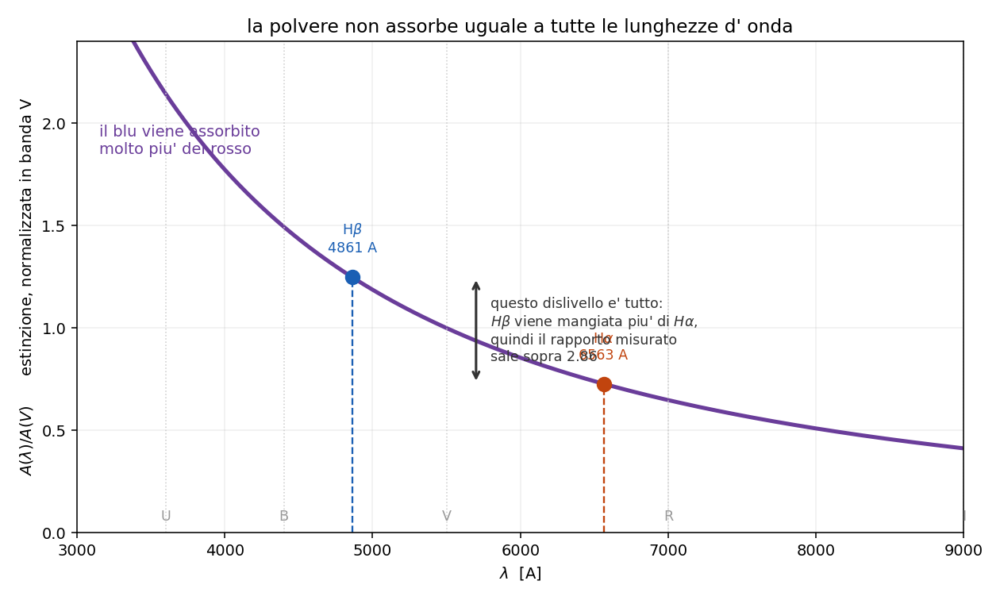

# 5.6 - Estinzione da polvere

**Dispensa: cap. 5.6 (pag. 66-69).**

_Capitolo in **PODS** nella seconda meta': il problema di misurare la polvere sembra
impossibile (servirebbe conoscere lo spettro vero), e la via d' uscita e' un' idea sola._

Fin qui si e' sempre parlato di gas. Ma nel mezzo interstellare, oltre al gas, ci sono i **grani di
polvere**: silicati, grafite, alluminio, ferro.

E questi grani rovinano tutto:

> quando guardo una stella o una nebulosa **non vedo il suo spettro vero**. La luce ha attraversato
> uno strato di polvere e mi arriva indebolita e con la forma cambiata.

Questo capitolo serve a due cose: capire **come** la polvere cambia lo spettro, e imparare a
**misurarla** per poterla togliere.

---

## 1. Cosa fa la polvere

Due cose, e vanno tenute distinte anche se producono lo stesso effetto:

**assorbe**: il grano si prende il fotone, si scalda, e riemette nell' infrarosso

**diffonde (scattering)**: il grano devia il fotone in un' altra direzione

Dal mio punto di vista il risultato e' lo stesso - quel fotone non mi arriva - e infatti i due
processi si mettono insieme in un unico coefficiente. Per questo si parla di **estinzione** e non
di assorbimento: e' la somma delle due cose.

---

## 2. Come si scrive l'attenuazione

E' la stessa equazione del [capitolo 3](c03_trasporto.md), ma senza il termine di emissione: la
polvere lungo il cammino toglie luce e basta (quello che riemette lo riemette nell' infrarosso,
quindi non torna nella banda che stai guardando).

$$dI_\lambda = -k_\lambda I_\lambda \, ds = -I_\lambda \, d\tau_\lambda$$

che integrata da':

$$I_\lambda = I_{0,\lambda} \, e^{-\tau_\lambda}$$

$I_{0,\lambda}$ $\quad$ lo spettro **intrinseco**, quello che la sorgente ha davvero

$I_\lambda$ $\quad$ quello che misuro io

$\tau_\lambda = \int k_\lambda ds$ $\quad$ la profondita' ottica della polvere lungo il cammino

Niente di nuovo, e' l' equazione del trasporto con $S = 0$.

---

## 3. In magnitudini

Gli astronomi non lavorano con $e^{-\tau}$ ma con le magnitudini, quindi traduciamo. Per
definizione di magnitudine:

$$I_\lambda = I_{0,\lambda} \, 10^{-0.4 A_\lambda}$$

Confrontando i due esponenti si ottiene la conversione, che e' solo un cambio di base del
logaritmo:

$$A_\lambda = 2.5 \log e \cdot \tau_\lambda = 1.086 \, \tau_\lambda$$

$A_\lambda$ $\quad$ **estinzione in magnitudini** a quella lunghezza d' onda

_**Attenzione:** il coefficiente e' 1.086, cioe' praticamente 1. Quindi:
**$\tau = 1$ vale circa una magnitudine di estinzione.** E' una di quelle coincidenze comode che
conviene tenere in testa, perche' permette di passare da un linguaggio all' altro a mente._

---

## 4. Perché si parla di arrossamento

Il punto e' che $\tau_\lambda$ **dipende dalla lunghezza d' onda**, e dipende parecchio: la polvere
assorbe molto piu' nel blu che nel rosso.

Studiando coppie di stelle dello stesso tipo spettrale a distanze diverse si scopre che la
dipendenza si puo' **fattorizzare**:

$$\tau_\lambda = c \cdot f(\lambda)$$

$c$ $\quad$ dipende da **quanta** polvere c'e' lungo quella direzione

$f(\lambda)$ $\quad$ la **legge di estinzione**: la forma, che e' sempre la stessa

_**Occhio a questo:** questa fattorizzazione e' quello che rende il problema risolvibile.
Vuol dire che la polvere ha sempre lo stesso "colore", cambia solo quanta ce n'e'. Quindi mi basta
misurare **un** numero ($c$) e so l' attenuazione a **tutte** le lunghezze d' onda._

---

### 4.1 La legge standard

La piu' usata e' quella di **Cardelli, Clayton & Mathis 1989 (CCM89)**, normalizzata alla banda V
(5500 A):

$$\frac{A(\lambda)}{A(V)} = a(x) + \frac{b(x)}{3.1}, \qquad x = \frac{10000}{\lambda} - 1.82$$

$x$ $\quad$ numero d' onda traslato, vale zero in banda V

$a(x), b(x)$ $\quad$ due polinomi, scritti per esteso nella dispensa

$3.1$ $\quad$ il valore standard di $R_V = A(V)/E(B-V)$ per il mezzo interstellare diffuso

---

### 4.2 Quanto arrossa, in numeri

Se $A(V) = 1$ magnitudine, del flusso originale sopravvive:

| banda | quanto passa |
|---|---|
| U (ultravioletto) | 23% |
| V (visibile) | 40% |
| I (infrarosso vicino) | 63% |

Lo spettro esce **tutto piu' debole ma sbilanciato verso il rosso**, e la stella sembra piu' fredda
di quello che e'. Questo e' l' **arrossamento**, e si quantifica con l' **eccesso di colore**:

$$E(B-V) = (B-V)_{oss} - (B-V)_0 = \frac{A(V)}{3.1}$$

---

## 5. Come si misura: il decremento di Balmer

E qui torna il trucco del [capitolo 5.5](c055_ricombinazione.md), ed e' il pezzo che rende utile tutto
il resto.

Il problema di misurare l' estinzione e' che dovrei conoscere lo spettro intrinseco, e non lo
conosco: e' quello che sto cercando di ricostruire. Serve **qualcosa di cui so gia' la risposta**.

Quel qualcosa e' il rapporto fra due righe di ricombinazione:

$$\left( \frac{I_{H\alpha}}{I_{H\beta}} \right)_0 \approx 2.86$$

Lo so gia', perche' nel [capitolo 5.5](c055_ricombinazione.md) si e' visto che nel rapporto la
geometria si semplifica: non dipende da quanto e' grande la nebulosa, quanto e' densa o quanto e'
lontana. Vale per **tutte** le nebulose.

---

### 5.1 Il ragionamento

1. so che quel rapporto **deve** valere 2.86
2. lo misuro, e mi viene per esempio 4.2
3. la differenza me l' ha messa la polvere: $H\beta$ (4861 A, blu) e' stata attenuata piu' di
   $H\alpha$ (6563 A, rosso)
4. da **quanto** mi sono scostato ricavo quanta polvere c'e'

Mettendo insieme l' attenuazione delle due righe con la CCM89:

$$\frac{I_{H\alpha}}{I_{H\beta}} = \left( \frac{I_{H\alpha}}{I_{H\beta}} \right)_0 10^{0.1386 \, A(V)}$$

e invertendo:

$$A(V) = 7.215 \, \log \frac{(I_{H\alpha}/I_{H\beta})_{misurato}}{2.86}$$

---

### 5.2 Perché questo metodo è comodo

**Non serve sapere niente della nebulosa.** Non quanto e' lontana, non quanto e' grande, non quanto
gas contiene. Tutta quella roba sta sia sopra che sotto nel rapporto e se ne va.

Servono solo due cose: il rapporto **misurato** fra due righe che escono dallo stesso posto, e il
valore **teorico** che quel rapporto dovrebbe avere.

_**Vale la pena dirlo:** e' il principio generale di tutta la spettroscopia diagnostica.
Un rapporto fra due righe della stessa sorgente e' un numero che non dipende dalla sorgente, e
quindi si puo' confrontare con la teoria. Ogni volta che nel corso salta fuori uno strumento di
misura - questo, il termometro [O III], il densimetro [S II] - sotto c'e' sempre lo stesso trucco._

---

### 5.3 Altre coppie di righe

Si puo' fare con qualsiasi coppia, cambia solo il coefficiente davanti:

| coppia | coefficiente |
|---|---|
| $H\alpha / H\beta$ | 7.215 |
| $H\beta / H\gamma$ | 13.713 |
| $H\beta / H\delta$ | 9.362 |

Il coefficiente **cresce** quando le due righe sono piu' vicine in lunghezza d' onda: la
differenza di estinzione fra loro e' piu' piccola, quindi va amplificata di piu' per tirarne fuori
lo stesso $A(V)$. Che vuol dire anche che la misura e' piu' rumorosa.

I rapporti teorici della serie si danno sempre **rispetto a $H\beta$**:
$H\gamma/H\beta \approx 0.47$, $H\delta/H\beta \approx 0.26$, e cosi' via.

---

## 6. In breve

- la polvere **assorbe e diffonde**: dal mio punto di vista i due effetti si sommano in un unico
  coefficiente di estinzione
- $I_\lambda = I_{0,\lambda} e^{-\tau_\lambda}$, cioe' il trasporto con $S = 0$
- in magnitudini: $A_\lambda = 1.086 \, \tau_\lambda$, quindi **$\tau = 1$ ~ 1 magnitudine**
- $\tau$ cresce verso il blu -> lo spettro si **arrossa** e la sorgente sembra piu' fredda
- $\tau_\lambda = c \cdot f(\lambda)$: la forma e' universale, cambia solo quanta polvere c'e'
- si misura col **decremento di Balmer**: si confronta $H\alpha/H\beta$ misurato col valore teorico
  2.86, e l' eccesso da' $A(V)$
- funziona perche' nel rapporto **la geometria si semplifica**: non serve sapere niente della
  nebulosa

---

## Domande tattiche

**1.** Per misurare quanto la polvere ha attenuato una sorgente servirebbe sapere com' era la
sorgente prima. Ma non lo sai. Come se ne esce? (-> sezione 5)

**2.** Perche' la polvere fa sembrare una stella piu' **fredda** di quello che e'? (-> sezione 4.2)

**3.** Il metodo del decremento di Balmer funziona senza sapere niente della nebulosa: ne' distanza,
ne' dimensione, ne' quanto gas contiene. Da dove viene questa liberta'? (-> sezione 5.2, e
[capitolo 5.5](c055_ricombinazione.md))

**4.** Perche' il coefficiente per la coppia $H\beta/H\gamma$ (13.7) e' piu' grande di quello per
$H\alpha/H\beta$ (7.2)? E cosa vuol dire in pratica sulla qualita' della misura? (-> sezione 5.3)

**5.** Una profondita' ottica $\tau = 2$ quante magnitudini di estinzione fa, all' incirca?
(-> sezione 3)
