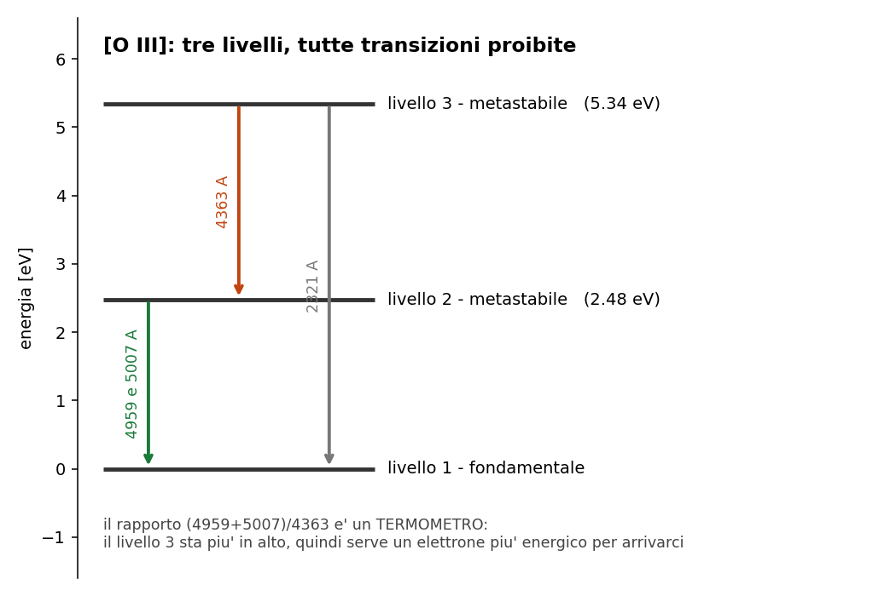
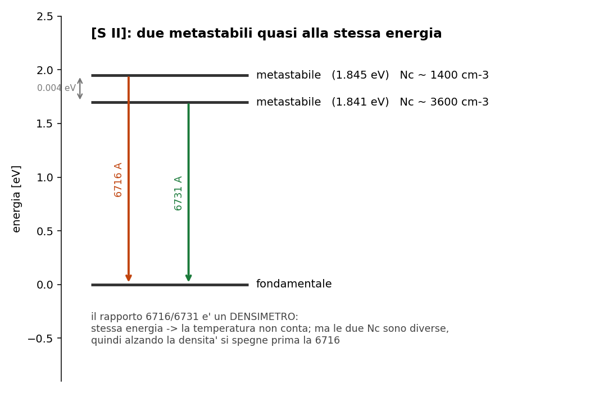

# 5.7 - Righe proibite: perche' esistono e come si usano

**Dispensa: cap. 5.7 (pag. 69-78).**

_Prima meta' in **PODS** (il mistero storico del nebulio, vedi il
[Di cosa parla tutto il corso](a1_di_cosa_parla.md)), seconda meta' a **mattoncini** sui due diagnostici._

Nelle nebulose si osservano righe intensissime che in laboratorio non si erano mai viste. Per un po'
si e' pensato che venissero da un elemento sconosciuto, e gli era stato dato pure un nome
("nebulio"). Poi si e' capito che erano righe **di elementi normalissimi**, che pero' sulla Terra
non si riescono a produrre.

Questo capitolo spiega perche', e poi mostra la cosa piu' utile del corso: come usarle per
**misurare** temperatura e densita' di un gas lontano anni luce.

---

## 1. Cosa vuol dire "proibita"

Una transizione e' proibita quando **viola le regole di selezione del dipolo elettrico**, che sono
il meccanismo con cui avvengono le transizioni normali.

Ma proibita **non vuol dire impossibile**: l' atomo puo' comunque scendere per altre vie, il
**quadrupolo elettrico** o il **dipolo magnetico**. Sono canali molto meno efficienti, ma esistono.

Il risultato e' un $A_{21}$ ridicolmente piccolo:

| tipo di transizione | $A_{21}$ |
|---|---|
| permessa (dipolo elettrico) | $\sim 10^8$ s$^{-1}$ |
| proibita | $\sim 10^{-2}$ s$^{-1}$ |

Dieci ordini di grandezza.

_**Questa e' la parte che conta:** il nome "proibita" e' fuorviante e conviene tradurselo. Sono righe
**improbabili**, o **pigre**: l' atomo ci mette secondi o minuti a fare quello che di solito fa in
$10^{-8}$ secondi. Non e' che non lo fa: e' che se la prende comoda._

**Notazione:** le righe proibite si scrivono fra parentesi quadre, tipo **[O III]**.

---

## 2. Il livello metastabile

Un livello si dice **metastabile** quando l' unica via d' uscita e' una transizione proibita.

L' elettrone che ci finisce sopra ci resta parcheggiato **secondi o minuti**, invece dei
$10^{-8}$ secondi di un livello normale.

---

### 2.1 Perché stanno sempre a pochi eV

Questa e' una domanda che uno dovrebbe farsi, perche' non e' una coincidenza.

I livelli metastabili stanno tipicamente **pochi eV** sopra il fondamentale, e il motivo e' che
nascono dalla **stessa configurazione elettronica** del fondamentale: gli elettroni sono negli
stessi orbitali, solo con spin o momenti angolari organizzati diversamente.

Da qui seguono due cose insieme:

1. **costa poco arrivarci**, perche' riorganizzare gli spin senza cambiare orbitale non richiede
   molta energia -> pochi eV
2. **e' proibito tornare giu'**, perche' una transizione di dipolo elettrico dentro la stessa
   configurazione non e' permessa

_**Nota subito così de botto:** le due cose hanno la stessa causa. Sono a bassa energia **perche'**
condividono la configurazione col fondamentale, e sono proibite **per lo stesso motivo**. Non sono
due proprieta' separate che capitano insieme._

E la prima e' proprio quello che serve: pochi eV vuol dire **raggiungibili per urto** a $10^4$ K,
dove gli elettroni hanno 0.86 eV. Il fondamentale dell' idrogeno, che sta a 10.2 eV dal primo
livello eccitato, non lo raggiunge nessuno.

---

## 3. Perché si vedono solo nelle nebulose

Adesso si mette insieme tutto quello che si e' costruito nel
[capitolo 5](c051_atomo_due_livelli.md).

La densita' critica e':

$$N_c = \frac{A_{21}}{Q_{21}}$$

Se $A_{21}$ e' minuscolo, allora **$N_c$ e' bassissima**. Per le righe proibite $N_c$ sta intorno
a $10^2 - 10^6$ cm$^{-3}$, che e' un vuoto spinto per gli standard terrestri.

| ambiente | $N_e$ | cosa succede |
|---|---|---|
| laboratorio, anche in vuoto | $\gg N_c$ | **quenching**: l' urto arriva prima dell' emissione |
| fotosfera stellare ($10^{14}$) | $\ggg N_c$ | quenching totale |
| nebulosa ($10^2 - 10^4$) | $\ll N_c$ | **l' atomo fa in tempo a emettere** |

In una nebulosa l' atomo eccitato puo' starsene tranquillo per minuti: tanto non passa nessuno a
disturbarlo.

---

### 3.1 La conseguenza da tenere

> **vedere una riga proibita e' gia' la prova che il gas e' rarefatto.**

Non serve nessuna misura ulteriore: la sua sola presenza nello spettro dice che $N_e < N_c$.

---

### 3.2 Sono sempre righe di emissione

E lo si puo' argomentare in due modi, che poi sono lo stesso.

**Guardando come si popolano**: il livello metastabile si popola **per urto**, non per
assorbimento di fotoni. Un atomo nel fondamentale che vede passare un fotone della giusta energia
non lo assorbe, perche' quella transizione e' proibita in tutte e due i versi.

**Guardando il criterio del [capitolo 3](c03_trasporto.md)**: nella nebulosa $I_0 \approx 0$ e il
gas emette, quindi $I < S$, quindi emissione.

---

## 4. E adesso il bello: si usano per misurare

Il fatto che si vedano solo nelle nebulose sarebbe una curiosita'. Quello che le rende importanti
e' che dallo spettro si tirano fuori **temperatura e densita'** del gas.

Il trucco e' sempre quello del [capitolo 5.5](c055_ricombinazione.md): **si fa il rapporto fra due
righe**, cosi' la geometria si semplifica e resta solo la fisica.

E la fisica che resta e' diversa a seconda di come sono messi i livelli:

| se i due livelli sono... | il rapporto sente... | esempio |
|---|---|---|
| a energie **molto diverse** | la **temperatura** | [O III] |
| a energie **quasi uguali** | la **densita'** | [S II] |

Adesso i due casi uno per volta.

---

## 5. [O III], il termometro

L' ossigeno ionizzato due volte ha due livelli metastabili, e stanno a energie **ben separate**:

| livello | energia |
|---|---|
| 1 - fondamentale | 0 |
| 2 - metastabile | **2.48 eV** |
| 3 - metastabile | **5.34 eV** |

Le transizioni possibili sono quattro (la $2 \to 1$ finisce su due sottolivelli del fondamentale):

| transizione | riga | usata? |
|---|---|---|
| $3 \to 1$ | 2321 A | no, e' nell' UV |
| $3 \to 2$ | **4363 A** | si' |
| $2 \to 1$ | **4959 A** | si' |
| $2 \to 1$ | **5007 A** | si' |

E il rapporto che si usa e':

$$R_{[O \, III]} = \frac{I_{4959} + I_{5007}}{I_{4363}}$$

---

### 5.1 Perché è un termometro

Le due righe al numeratore partono dal livello 2 (2.48 eV), quella al denominatore parte dal
livello 3 (5.34 eV).

Per popolare il livello 3 serve un elettrone **piu' energetico** che per popolare il livello 2. E
quanti elettroni energetici ci sono dipende **solo dalla temperatura**.

Quindi:

- **gas freddo**: pochi elettroni arrivano fino al livello 3 -> la 4363 e' debolissima ->
  $R$ **grande**
- **gas caldo**: il livello 3 si popola -> la 4363 cresce -> $R$ **piccolo**

Nel rapporto la geometria se ne va e resta essenzialmente il fattore di Boltzmann della differenza
di energia:

$$R \sim e^{\Delta\chi / k_B T}$$

Per dare l' idea di quanto sia sbilanciato: eccitare al livello 2 e' circa **200 volte piu'
probabile** che eccitare al livello 3.

---

### 5.2 Perché è cieco alla densità

Questa e' la parte che rende [O III] uno strumento pulito, e va detta esplicitamente.

Le densita' critiche dei suoi livelli metastabili stanno **molto sopra** il range nebulare. Quindi
in una nebulosa siamo sempre e comunque nel regime $N_e \ll N_c$ per tutte e tre le righe, e la
densita' **non entra nel rapporto**.

$R_{[O \, III]}$ misura la temperatura e non si fa disturbare da nient' altro.

---

## 6. [S II], il densimetro

Lo zolfo ionizzato una volta ha anche lui due livelli metastabili, ma stanno praticamente **alla
stessa energia**:

| riga | energia del livello |
|---|---|
| 6716 A | 1.845 eV |
| 6731 A | 1.841 eV |

**Quattro millesimi di eV** di differenza, contro i 2.9 eV che separavano i due livelli di [O III].

Il rapporto che si usa e':

$$R_{[S \, II]} = \frac{I_{6716}}{I_{6731}}$$

---

### 6.1 Perché la temperatura non conta

Il fattore di Boltzmann fra i due livelli e' $e^{-0.004/k_BT}$, e a $10^4$ K vale praticamente **1**.

Cioe': un elettrone che ha abbastanza energia per popolare uno dei due, ne ha abbastanza anche per
popolare l' altro. La temperatura non riesce a distinguerli.

---

### 6.2 Perché la densità invece conta

Perche' i due livelli hanno **$A_{21}$ diversi**, e quindi **densita' critiche diverse**:

| riga | $N_c$ |
|---|---|
| 6716 | ~1400 cm$^{-3}$ |
| 6731 | ~3600 cm$^{-3}$ |

E quei due numeri stanno **dentro** il range delle densita' nebulari, mentre quelli di [O III]
stanno molto piu' su.

Alzando la densita', la transizione **piu' lenta** (quella con $N_c$ piu' bassa, la 6716) viene
spenta per prima dagli urti, mentre l' altra regge ancora un po'. Quindi il rapporto cala.

| regime | $R_{[S \, II]}$ |
|---|---|
| $N_e \ll N_c$ (bassa densita') | ~**1.4** |
| $N_e \gg N_c$ (alta densita') | ~**0.4** |

---

### 6.3 Attenzione: funziona solo dentro una finestra

Vale la pena dirlo perche' e' il limite del metodo.

Se la densita' e' **troppo bassa**, nessuna delle due righe e' disturbata: si comportano uguali e
il rapporto e' piatto a 1.4.

Se la densita' e' **troppo alta**, tutte e due sono spente allo stesso modo: il rapporto e' piatto
a 0.4.

Il rapporto misura qualcosa **solo nella zona in mezzo**, dove una e' spenta e l' altra no. Ed e'
esattamente il motivo per cui serve che le $N_c$ cadano dentro il range che si vuole misurare.

_**In pratica:** e' il principio di qualsiasi strumento di misura. Un termometro da
febbre non serve a misurare la temperatura del forno. Uno strumento funziona nel range in cui la
grandezza che misuri fa cambiare davvero quello che leggi._

---

## 7. Il quadro dei due diagnostici

| | [O III] | [S II] |
|---|---|---|
| separazione dei livelli | **2.9 eV** | **0.004 eV** |
| $N_c$ rispetto al range nebulare | molto **sopra** | **dentro** |
| il rapporto sente | la **temperatura** | la **densita'** |
| righe | (4959+5007)/4363 | 6716/6731 |
| valori | $R$ grande = freddo | 1.4 = rarefatto, 0.4 = denso |

Usati **insieme** danno temperatura e densita' della stessa nebulosa: [O III] misura $T_e$ senza
sentire la densita', poi con quella $T_e$ nota si legge [S II] per avere $N_e$.

---

## 8. In breve

- proibita = viola le regole di selezione del **dipolo elettrico**, ma avviene lo stesso per
  quadrupolo elettrico o dipolo magnetico
- proibita **non vuol dire impossibile**: vuol dire $A_{21} \sim 10^{-2}$ invece di $10^8$
- **metastabile** = livello da cui si esce solo con una transizione proibita
- stanno a pochi eV perche' hanno la **stessa configurazione elettronica** del fondamentale, ed e'
  la stessa ragione per cui la transizione e' proibita
- si popolano **per urto**, non per assorbimento, e sono sempre righe di **emissione**
- $N_c = A_{21}/Q_{21}$ e' bassissima: in laboratorio si spengono, in una nebulosa no
- **vedere una riga proibita e' gia' la prova che il gas e' rarefatto**
- **[O III]** = termometro: livelli lontani (2.48 e 5.34 eV), $N_c$ fuori range
- **[S II]** = densimetro: livelli vicini (0.004 eV), $N_c$ dentro range

---

## Domande tattiche

**1.** "Proibita" non vuol dire impossibile. Allora cosa vuol dire, esattamente, e che numero
cambia? (-> sezione 1)

**2.** I livelli metastabili stanno sempre a pochi eV sopra il fondamentale. Non e' una
coincidenza: da cosa dipende? E perche' proprio quella stessa cosa li rende proibiti?
(-> sezione 2.1)

**3.** Vedi una riga proibita nello spettro. Prima ancora di misurare qualsiasi cosa, cosa sai
gia' di quel gas? (-> sezione 3.1)

**4.** [O III] misura la temperatura e [S II] la densita'. Cos' e' che rende uno un termometro e
l' altro un densimetro? La risposta e' una sola proprieta', detta in due modi. (-> sezioni 5.1 e 6.2)

**5.** Perche' [O III] **non** funziona anche come densimetro, visto che ha pure lui delle $N_c$?
(-> sezione 5.2)

**6.** Misuri $R_{[S\,II]} = 1.4$. Puoi dire quanto vale la densita', o solo qualcosa di piu'
debole? (-> sezione 6.3)

**7.** Le righe proibite si popolano per urto e non per assorbimento. Prova a spiegare perche'
usando le stesse regole di selezione della sezione 1. (-> sezione 3.2)
