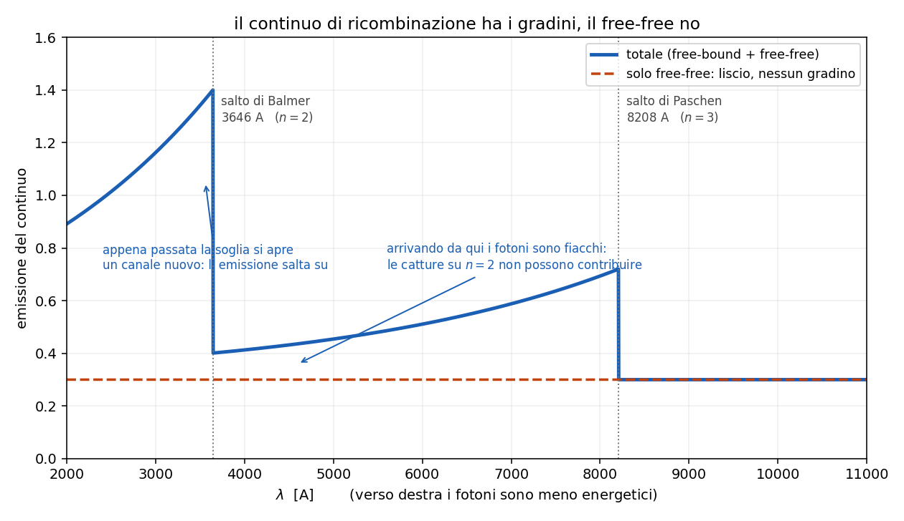

# 6 - I continui

**Dispensa: cap. 6 (pag. 79-92).**

_Capitolo a **mattoncini**, ma corti: c'e' una regola madre e tre casi che le obbediscono.
Il pezzo delicato e' il gradino, e li' si va piano._

Fin qui si sono guardate le righe. Ma in uno spettro, sotto le righe, c'e' sempre un **continuo**:
emissione a tutte le lunghezze d' onda, senza salti.

Da dove viene?

---

## 1. La regola madre

Tutto il capitolo sta in una riga:

$$\text{elettrone legato} \rightarrow \text{riga} \qquad\qquad \text{elettrone libero} \rightarrow \text{continuo}$$

**Perche'**: se l' elettrone e' attaccato all' atomo puo' stare solo su livelli discreti, quindi i
salti sono discreti e quello che esce sono righe.

Se invece e' **libero**, la sua energia cinetica puo' valere qualsiasi cosa (segue Maxwell-Boltzmann
e dipende da $T_e$). Quindi i fotoni che escono possono avere qualsiasi energia: viene fuori un
continuo.

_**Da ricordare:** questa regola risolve da sola meta' delle domande sul capitolo. Se
ti chiedono da dove viene un continuo, la risposta comincia sempre con "c'e' un elettrone libero in
gioco"._

---

### 1.1 Chi è che irraggia

Sempre e solo l' **elettrone**. Il nucleo, in pratica, non irraggia.

Il motivo e' il rapporto di massa. Il protone pesa 1836 volte l' elettrone, quindi a parita' di
forza sente un' accelerazione 1836 volte piu' piccola. E la potenza irraggiata va come
l' accelerazione **al quadrato** (formula di Larmor), quindi il protone irraggia un fattore
$\sim 3 \times 10^6$ in meno.

I nuclei fanno da **sorgente di campo elettrico** e restano li' praticamente fermi.

---

## 2. Come si ordinano i tre casi

Il modo piu' pulito di tenerli a mente e' guardare **com'e' l' elettrone prima e dopo**:

| processo | prima | dopo | continuo |
|---|---|---|---|
| **free-free** | libero | libero | liscio, nessuna soglia |
| **free-bound** | libero | legato | **con gradini** |
| **sincrotrone** | libero | libero | legge di potenza, non termico |

---

## 3. Free-free (bremsstrahlung)

L' elettrone libero passa vicino a uno ione. Il campo dello ione lo devia e lo frena, lui perde un
pezzo di energia cinetica e la butta fuori come fotone.

Prima era libero, dopo e' ancora libero: cambia solo la velocita'.

**Perche' e' liscio**: l' energia persa nella deviazione puo' essere qualunque, dipende da quanto
vicino ci passa e da quanto andava veloce. Quindi non ci sono ne' soglie ne' gradini.

---

### 3.1 Il taglio ad alta frequenza

C'e' pero' un limite ovvio: **un elettrone non puo' emettere un fotone piu' energetico della sua
energia cinetica.**

$$\frac{1}{2} m_e v^2 \geq h\nu$$

Integrando su una maxwelliana con quel vincolo, viene fuori un esponenziale:

$$\varepsilon_{ff} \propto \frac{N_e N_i}{T_e^{1/2}} \, g_{ff} \, e^{-h\nu / k_B T_e}$$

$g_{ff}$ $\quad$ fattore di Gaunt, una correzione quantistica, sta intorno a 1.2-1.5

L' esponenziale dice che sopra $k_B T_e$ il continuo crolla: gli elettroni non hanno abbastanza
energia per fare quei fotoni.

---

### 3.2 Le dipendenze, che sono due formule diverse

Qui e' facile fare confusione, quindi separiamo:

**monocromatica** (a una data $\nu$): va come $N_e^2$ e come $T_e^{-1/2}$, ma c'e' anche
l' esponenziale che **cresce** con $T_e$. In un certo intervallo l' esponenziale vince, e
$\varepsilon_{ff}$ sale con la temperatura.

**integrata** su tutte le frequenze: l' esponenziale e' gia' stato integrato via e resta

$$\varepsilon_{ff} \propto N_e N_i \, T_e^{1/2}$$

Cioe' il segno dell' esponente di $T_e$ **si rovescia** fra le due. Vale la pena sapere di quale
delle due si sta parlando.

---

### 3.3 Nel radio

Il free-free e' un processo **puramente collisionale**, quindi siamo in LTE e vale
$\varepsilon_{ff} = k_{ff} B_\nu(T_e)$.

Nel radio ($h\nu \ll k_B T_e$) la profondita' ottica va come

$$\tau_{ff} \propto T_e^{-1.35} \, \nu^{-2.1} \, EM$$

dove $EM = \int N_e N_i \, dr$ e' l' **emission measure**.

L' esponente negativo su $\nu$ dice che **a frequenza bassa il gas diventa opaco**. Una nube tipica
diventa otticamente spessa sotto qualche centinaio di MHz, e i due regimi danno cose diverse:

| regime | andamento | cosa ci tiri fuori |
|---|---|---|
| $\tau \ll 1$ (sopra ~1 GHz) | $I_\nu \propto T_e^{-0.35} \nu^{-0.1}$, quasi piatto | la **densita' elettronica** |
| $\tau \gg 1$ (sotto ~1 GHz) | $I_\nu \propto T_e \, \nu^2$ | la **temperatura** |

---

## 4. Free-bound (continuo di ricombinazione)

Qui l' elettrone libero viene **catturato** da uno ione e finisce legato su un livello $n$. E' il
contrario esatto della fotoionizzazione.

E' lo stesso processo di cui si parla nel [capitolo 5.5](c055_ricombinazione.md): li' interessava la
**cascata**, qui interessa il fotone della **cattura**.

$$h\nu = E_{cin} + \frac{13.6}{n^2} \; eV$$

---

### 4.1 Perché ha i gradini e il free-free no

E' la differenza chiave fra i due, quindi la scrivo lenta.

$E_{cin}$ puo' essere qualsiasi cosa, **ma non puo' essere negativa**. Quindi anche se l' elettrone
arriva fermissimo, il fotone vale almeno $13.6/n^2$.

> ogni livello $n$ ha la sua **energia minima**, e sotto quella soglia le catture su quel livello
> non producono niente.

Quindi il continuo di ricombinazione non e' liscio: e' fatto di pezzi che si accendono uno alla
volta.

| $n$ | $\chi_n$ | $\lambda$ della soglia | serie |
|---|---|---|---|
| 1 | 13.6 eV | 912 A | Lyman |
| 2 | 3.4 eV | **3648 A** | Balmer |
| 3 | 1.5 eV | 8208 A | Paschen |

---

### 4.2 Come si legge un gradino

Prendi il salto di Balmer, a 3648 A, e arrivaci **da destra**, cioe' da lunghezze d' onda piu'
lunghe (fotoni meno energetici):

- **a 4000 A**: le catture su $n=2$ non possono contribuire, sono troppo poco energetiche.
  Contribuiscono solo $n=3$ e oltre.
- **a 3600 A**: si aggiungono **tutte** le catture su $n=2$, che sono tantissime.

Un canale nuovo si apre di colpo, e l' emissione **salta su**. Quello e' il gradino.

_**Da tenere:** il gradino sembra un difetto del grafico e invece e' roba da
leggere. La sua posizione ti
dice quale livello si e' aperto, e la sua altezza quanto quel livello viene popolato. E' il modo in
cui il continuo si porta dietro la struttura discreta dell' atomo._

---

### 4.3 Chi vince fra free-free e free-bound

Nelle nebulose vince **la ricombinazione**, e c'e' un numero preciso: il free-free supera il
free-bound solo sopra

$$T_e > 3.15 \times 10^5 \; K$$

Le nebulose stanno a $10^4$ K, cioe' una trentina di volte sotto. Quindi nel visibile e nell' UV il
continuo che vedi e' quello **di ricombinazione**.

---

### 4.4 Un risultato che serve dopo

La sezione d' urto di ricombinazione va come $1/v^2$: **ricombinano preferenzialmente gli elettroni
lenti**, mentre la fotoionizzazione ne libera di veloci.

Conseguenza: anche in equilibrio di ionizzazione, con tante ionizzazioni quante ricombinazioni, il
bilancio energetico netto e' un **riscaldamento del gas**. Serve nel
[capitolo 9](c09_equilibrio_termico.md).

---

## 5. Il continuo a due fotoni

C'e' un terzo continuo, tipico delle nebulose, e nasce da una transizione proibita.

L' idrogeno che finisce sul livello **2s** non puo' scendere a 1s emettendo un fotone solo: quella
transizione e' proibita. Quello che fa e' emettere **due fotoni** che si spartiscono i 10.2 eV in
tutti i modi possibili.

Siccome la ripartizione e' continua, quello che ne esce e' un **continuo largo** sotto 1216 A.

_**Qui si nota una cosa:** e' un altro caso in cui il gas rarefatto fa vedere qualcosa che
altrove non si vedrebbe. A densita' alta il 2s verrebbe spostato per urto prima di riuscire a
fare il doppio decadimento, quindi questo continuo si spegnerebbe. Stessa logica delle righe
proibite del [capitolo 5.7](c057_righe_proibite.md)._

---

## 6. Sincrotrone

Caso completamente diverso dagli altri: qui non serve nessuno ione, serve un **campo magnetico**.

Elettroni **relativistici** dentro un campo $B$: la forza di Lorentz li fa spiralare attorno alle
linee di campo, e una carica accelerata irraggia.

$$\nu_c = \frac{3}{2} \frac{\gamma^2 e B \sin\theta}{2\pi m_e} \propto E^2 B$$

$\nu_c$ $\quad$ frequenza critica, dove il singolo elettrone emette quasi tutto

$\theta$ $\quad$ pitch angle, l' angolo fra la velocita' e il campo

L' emissione esce in un **cono** di semiapertura $1/\gamma$: piu' l' elettrone e' veloce, piu' il
fascio e' stretto.

---

### 6.1 Perché viene una legge di potenza

Il singolo elettrone da solo non basta: bisogna sommare su tutta la popolazione. E si assume che
gli elettroni abbiano una distribuzione in energia a legge di potenza (come i raggi cosmici):

$$N_e(E) \, dE = k E^{-s} \, dE$$

Mettendo insieme questo con $\nu_c \propto E^2 B$ si arriva a:

$$I_{syn} \propto \nu^{-\alpha}, \qquad \alpha = \frac{s-1}{2}$$

$s$ $\quad$ indice della distribuzione in energia degli elettroni

$\alpha$ $\quad$ indice spettrale: ~0.5 per i resti di supernova, 0.5-2 per le radiosorgenti estese

---

### 6.2 Come si riconosce a occhio

**Va disegnato in log-log.** Una legge di potenza in log-log diventa una **retta**, di pendenza
$-\alpha$.

E' il modo per distinguerlo al volo da un continuo termico, che in log-log non e' una retta.

_**Nota:** il sincrotrone e' **non termico**, e questa e' la differenza vera
con gli altri due. Free-free e free-bound nascono da elettroni con una distribuzione maxwelliana,
cioe' da un gas che ha una temperatura. Il sincrotrone nasce da elettroni accelerati da qualcos'
altro (shock, campi magnetici), che una temperatura non ce l' hanno. Per quello lo spettro ha una
forma completamente diversa._

---

## 7. In breve

- **legato -> riga, libero -> continuo**
- irraggia sempre l' **elettrone**, perche' il protone e' 1836 volte piu' pesante e la potenza va
  come $a^2$
- **free-free**: libero prima e dopo, continuo **liscio**, termico, in LTE, importante nel radio
- **free-bound**: libero prima e legato dopo, quindi c'e' un' energia **minima** $13.6/n^2$ e il
  continuo ha i **gradini** (912, 3648, 8208 A)
- nelle nebulose a $10^4$ K **domina il free-bound**: il free-free vincerebbe solo sopra
  $3 \times 10^5$ K
- **due fotoni**: dal 2s dell' idrogeno, continuo largo, tipico del gas rarefatto
- **sincrotrone**: elettroni relativistici in campo magnetico, **non termico**, $I \propto
  \nu^{-\alpha}$ con $\alpha = (s-1)/2$, retta in log-log

---

## Domande tattiche

**1.** Perche' un elettrone libero fa un continuo e uno legato fa una riga? Deve venire dalla
regola madre, in una frase. (-> sezione 1)

**2.** Il free-free e' liscio, il free-bound ha i gradini. Eppure in tutti e due c'e' un elettrone
libero. Da dove salta fuori la differenza? (-> sezione 4.1)

**3.** Ti trovi a 4000 A e ti sposti verso 3600 A. L' emissione salta su. Cosa e' successo
esattamente in quel punto? (-> sezione 4.2)

**4.** In una nebulosa a $10^4$ K, quale dei due continui domina nel visibile? E a che temperatura
si invertirebbe? (-> sezione 4.3)

**5.** Guardi uno spettro in log-log e vedi una retta. Cosa hai davanti, e perche' quella forma
esclude gli altri due processi? (-> sezioni 6.1 e 6.2)

**6.** Il continuo a due fotoni si vede nelle nebulose e non in laboratorio. La ragione e' la
stessa di un altro capitolo: quale, e perche'? (-> sezione 5, e
[capitolo 5.7](c057_righe_proibite.md))

**7.** Perche' il nucleo dell' atomo non contribuisce quasi per niente all' emissione? Il conto e'
di una riga. (-> sezione 1.1)
