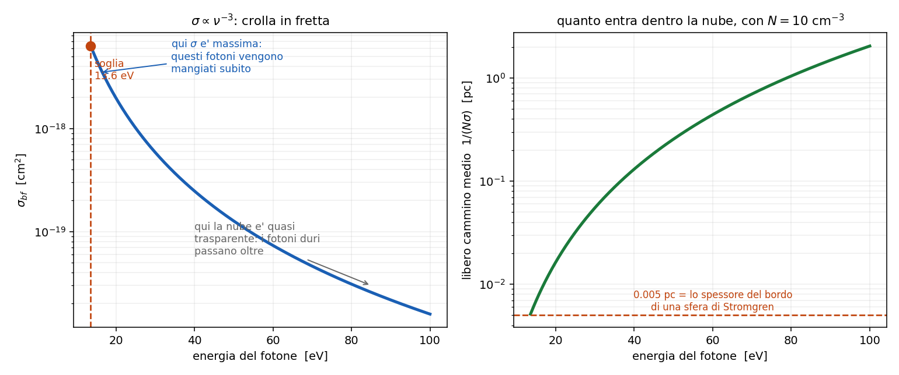

# 7 - Sezione d' urto ed equilibrio di ionizzazione

**Dispensa: cap. 7 (pag. 93-98).**

_Prima meta' a **mattoncini** (la sezione d' urto e' uno strumento, e va costruito prima di
usarlo), seconda meta' in **PODS**: si scrive il bilancio completo e poi si butta via meta'
dei termini, ma spiegando ogni volta perche' si puo' fare._

Questo capitolo risponde alla domanda:

> in una nebulosa, quanto idrogeno e' ionizzato e quanto e' ancora neutro?

Nel [capitolo 2](c02_boltzmann_saha.md) la risposta la dava Saha. Qui Saha **non si puo' usare**,
perche' vale in equilibrio termodinamico e in una nebulosa non ci siamo. Il bilancio va fatto a
mano, come nel [capitolo 5](c051_atomo_due_livelli.md).

Ma prima serve uno strumento.

---

## 1. La sezione d' urto: cos'e'

La sezione d' urto $\sigma$ e' l' **area efficace del bersaglio**: quanto e' probabile che
l' interazione avvenga, tradotta in centimetri quadri.

L' immagine da tenere: io fotone (o io elettrone) arrivo addosso a una nube. Ogni bersaglio si
porta dietro un **dischetto** di area $\sigma$. Se ci finisco dentro succede qualcosa, se ci passo
di fianco tiro dritto.

_**SIGNIFICATO FISICO:** $\sigma$ si misura in cm$^2$ ma **non e' la taglia geometrica
dell' atomo**. E' quanto quell' atomo e' "grosso" **per quel processo li'**. Lo stesso atomo ha
$\sigma$ diverse per processi diversi, e per la fotoionizzazione cambia anche con l' energia del
fotone che arriva._

---

### 1.1 Un caso in cui coincide davvero con l' area

Per gli urti fra atomi di idrogeno neutri nel fondamentale si prende proprio il disco di Bohr:

$$\sigma = \pi a_B^2 \simeq 0.88 \times 10^{-16} \; \text{cm}^2$$

$a_B$ $\quad$ raggio di Bohr, $0.53 \times 10^{-8}$ cm

Qui $\sigma$ e' davvero l' area dell' atomo, ma e' un caso particolare: sono due palline che si
urtano. Negli altri casi non e' cosi'.

---

## 2. Primo uso della sezione d' urto: opacita'

Se ho $N$ bersagli per cm$^3$ e ognuno mi offre $\sigma$ di area, in un centimetro di cammino
intercetto:

$$k = N \sigma \qquad [\text{cm}^{-1}]$$

ed e' proprio il coefficiente di assorbimento del [capitolo 3](c03_trasporto.md). Su uno spessore
$L$:

$$\tau = N \sigma L$$

Da cui una lettura molto utile:

$$\tau = 1 \quad \Leftrightarrow \quad L = \frac{1}{N\sigma}$$

**$\tau = 1$ vuol dire un' interazione a testa**, e $1/(N\sigma)$ e' il **libero cammino medio**:
la distanza dopo la quale il fotone medio e' stato mangiato.

---

## 3. Secondo uso: rate collisionali

Nelle collisioni il bersaglio non sta fermo: ci arrivo addosso a velocita' $v$, e le velocita' sono
maxwelliane. Quindi non basta $\sigma$, serve la media del prodotto:

$$Q = \langle \sigma v \rangle = \int_0^\infty v \, \sigma(v) \, f(v) \, dv \qquad [\text{cm}^3 \text{s}^{-1}]$$

_**Nota subito così de botto:** le unita' lo spiegano da sole. cm$^2$ per cm/s fa cm$^3$/s, cioe'
**il volume che il mio dischetto spazza in un secondo**. Moltiplicato per la densita' dei partner
da' il numero di urti al secondo: $C = N Q$ in s$^{-1}$._

Questo $Q$ e' esattamente quello che entra nell' atomo a due livelli del
[capitolo 5](c051_atomo_due_livelli.md) e nella densita' critica $N_c = A_{21}/Q_{21}$.

Per la diseccitazione collisionale la dispensa arriva a:

$$Q_{nm} = \frac{8.63 \times 10^{-6}}{\sqrt{T_e}} \frac{\langle \Omega(m,n) \rangle}{g_n}$$

$\Omega$ $\quad$ collision strength

Nota che $Q$ dipende **solo da $T_e$** (va come $T_e^{-1/2}$): la densita' entra dopo, nel rate.

---

### 3.1 Quanto sono rari gli urti, in numeri

Vale la pena vederlo, perche' e' il numero che giustifica tutto il capitolo 5.

Con $T_e = 10^4$ K viene $Q \simeq 10^{-7}$ cm$^3$ s$^{-1}$, e con $N_e = 10^3$ cm$^{-3}$ il rate e'
$C = N_e Q \simeq 10^{-4}$ s$^{-1}$:

> **una diseccitazione collisionale ogni 2.8 ore.**

Con gli atomi neutri nel mezzo interstellare diffuso si scende a **un urto ogni 3170 anni**.

Adesso e' chiaro perche' una riga proibita, che ci mette secondi o minuti a uscire, fa comodamente
in tempo.

---

## 4. Terzo uso: la fotoionizzazione

Qui $\sigma$ dipende dall' energia del fotone:

$$\sigma_{bf} \simeq 2.81 \times 10^{29} \frac{Z^4}{n^5 \nu^3} \qquad [\text{cm}^2]$$

$Z$ $\quad$ carica nucleare efficace

$n$ $\quad$ livello di partenza dell' elettrone

$\nu$ $\quad$ frequenza del fotone

Per l' idrogeno dal fondamentale, alla soglia di 13.6 eV, il valore tabulato e':

$$\sigma \simeq 6.3 \times 10^{-18} \; \text{cm}^2$$

cioe' una quindicina di volte **sotto** l' area geometrica dell' atomo.

---

### 4.1 La dipendenza che conta: $\nu^{-3}$

$$\sigma \propto \nu^{-3}$$

Cala **in fretta** appena il fotone diventa piu' energetico. Conseguenza fisica diretta:

- i fotoni **appena sopra la soglia** vengono divorati subito, a pochi passi dentro la nube
- i fotoni **molto energetici** vedono la nube quasi trasparente e **penetrano molto piu' a fondo**

_**Nota subito così de botto:** questo e' controintuitivo la prima volta. Verrebbe da pensare che
un fotone piu' energetico ionizzi meglio. Invece no: passa oltre. Ionizzare bene vuol dire avere
l' energia **giusta**, non tantissima._

---

## 5. L' equilibrio di ionizzazione: l' equazione generale

Si scrive che tutto quello che ionizza pareggia tutto quello che ricombina:

$$N_i R_{i,i+1} + N_i C_{i,i+1} = N_{i+1} R_{i+1,i} + N_{i+1} C_{i+1,i}$$

$R_{i,i+1}$ $\quad$ rate di **fotoionizzazioni** (s$^{-1}$)

$C_{i,i+1}$ $\quad$ rate di **ionizzazioni collisionali**

$R_{i+1,i}$ $\quad$ rate di **ricombinazioni**

$C_{i+1,i}$ $\quad$ rate di ricombinazioni collisionali

Quattro termini. Adesso se ne buttano via due, e i motivi sono interessanti.

---

### 5.1 Via le ricombinazioni collisionali

$C_{i+1,i}$ e' un processo **a tre corpi**: servono uno ione, un elettrone che ricombina, e un
terzo corpo che si porti via l' energia in eccesso.

Far incontrare tre cose nello stesso posto richiede **densita' alta**. In una nebulosa non succede
mai. Si butta.

---

### 5.2 Via le ionizzazioni collisionali

Per ionizzare l' idrogeno per urto servono elettroni da 13.6 eV. Facendo il conto con la
maxwelliana, la frazione utile e':

| $T_e$ | $k_B T_e$ | quanto pesa |
|---|---|---|
| $10^4$ K | 0.86 eV | $2 \times 10^{-6}$ |
| $2 \times 10^4$ K | 1.72 eV | $4 \times 10^{-3}$ |
| $4 \times 10^4$ K | 3.44 eV | 0.17 |
| $10^5$ K | 8.61 eV | 1.56 |

Serve $T_e > 10^5$ K perche' la ionizzazione collisionale conti qualcosa. Le nebulose stanno a
$10^4$ K, dieci volte sotto. Si butta anche questa.

_**Attenzione:** guarda quanto e' brusca quella colonna: da $10^4$ a $10^5$ K
cambia di sei ordini di grandezza. E' la firma dell' esponenziale: quando devi raggiungere
un' energia molto sopra $k_BT$, non ci arrivi "un po'", non ci arrivi **per niente**._

(Un contributo residuo lo danno i **raggi cosmici**, particelle da 0.3-100 MeV che ionizzano per
urto: $C_{0,1} \sim 10^{-17}$ s$^{-1}$. Piccolo, ma non zero.)

---

### 5.3 Quello che resta

$$N_0 R_{0,1} = N_1 R_{1,0}$$

> **le fotoionizzazioni pareggiano le ricombinazioni.**

Cioe': in una nebulosa si ionizza **con la luce** e si ricombina **con gli elettroni**. E' tutto qui.

---

## 6. Il rate di fotoionizzazione

$$N_0 R_{0,1} = 4\pi \int_{\nu_0}^{\infty} \frac{k_{bf}}{h\nu} I_\nu \, d\nu$$

Si integra **da $\nu_0$ in su**, la soglia a 13.6 eV: sotto quella frequenza i fotoni non ionizzano
e non contano.

Nel conto entrano due cose:

1. $\sigma_{bf} \propto \nu^{-3}$, la sezione d' urto della parte A
2. il campo di radiazione della stella, **fortemente diluito**

---

### 6.1 Il fattore di diluizione

Questo e' il pezzo che spiega perche' le nebulose sono quello che sono.

La stella emette come un corpo nero alla sua temperatura, ma la nebulosa e' **lontana**. Il campo
di radiazione che arriva li' e' lo stesso come **forma** (stessa distribuzione in frequenza), ma
ridotto in intensita' di un fattore geometrico:

$$w \sim 10^{-15}$$

Sono quindici ordini di grandezza.

_**Occhio a questo:** ecco l' origine di tutto il comportamento non-LTE delle nebulose.
Il gas "vede" una radiazione che ha la forma di un corpo nero a $4 \times 10^4$ K ma
l' **intensita'** di quasi niente. Quindi non puo' termalizzarsi con quella radiazione, e le
popolazioni dei livelli non hanno nessun motivo di seguire Boltzmann. E' la stessa diluizione che
nel [capitolo 5](c051_atomo_due_livelli.md) permetteva di buttare via il termine radiativo
$U B_{12}$._

Il risultato del conto, per una stella a $4 \times 10^4$ K:

$$R_{0,1} \sim 10^{-8} \; \text{s}^{-1}$$

Cioe' un atomo neutro viene fotoionizzato mediamente **una volta ogni tre anni**.

---

## 7. Il rate di ricombinazione

$$R_{1,0} = N_e \alpha, \qquad \alpha = \sum_{n=1}^{\infty} \alpha_n$$

$\alpha_n$ $\quad$ coefficiente di ricombinazione **sul livello $n$**, in cm$^3$ s$^{-1}$

La somma su tutti gli $n$ c'e' perche' l' elettrone puo' essere catturato su qualsiasi livello.

Ogni $\alpha_n$ si ottiene mediando la sezione d' urto di ricombinazione sulla maxwelliana, ed e' lo
stesso oggetto che nel [capitolo 5.5](c055_ricombinazione.md) alimentava la cascata.

L' andamento:

$$\alpha_n \propto \frac{1}{T_e^{3/2} \, n^3}$$

**Cala con la temperatura**: un elettrone veloce fa piu' fatica a farsi catturare, sfreccia via.

**Cala come $1/n^3$**: le catture sui livelli bassi sono le piu' probabili.

---

### 7.1 Ricombinano gli elettroni lenti

La sezione d' urto di ricombinazione va come $1/v^2$: **ricombinano preferenzialmente gli elettroni
lenti**, mentre la fotoionizzazione ne libera di veloci.

Conseguenza che serve nel [capitolo 9](c09_equilibrio_termico.md): anche in equilibrio perfetto,
con tante ionizzazioni quante ricombinazioni, il bilancio energetico netto e' un **riscaldamento
del gas**. Entrano elettroni veloci ed escono elettroni lenti, e la differenza resta nel gas.

---

## 8. Il risultato

Mettendo insieme:

$$N_0 R_{0,1} = N_1 N_e \alpha \qquad \rightarrow \qquad \frac{N_1}{N_0} = \frac{R_{0,1}}{N_e \alpha}$$

Coi numeri di una nebulosa tipica, quel rapporto viene **enorme**: l' idrogeno e' ionizzato al
99.99% e passa. La frazione neutra e' una minuzia.

E il motivo, guardando i due rate, e' che $R_{0,1}$ ha davanti tutta la luce della stella mentre
$N_e \alpha$ e' frenato dalla densita' ridicola del gas.

---

### 8.1 Il collegamento col capitolo dopo

Questo conto e' stato fatto **in un punto**, assumendo di sapere quanti fotoni ionizzanti ci sono
li'.

Ma i fotoni ionizzanti **si consumano**: piu' vai lontano dalla stella, meno ne restano. Quindi la
domanda vera diventa: fino a dove arriva la zona ionizzata?

Quella e' la sfera di Stromgren, [capitolo 8](c08_stromgren.md).

---

## 9. In breve

**Sezione d' urto:**

- $\sigma$ e' un' **area efficace** in cm$^2$, non la taglia dell' atomo
- $k = N\sigma$, $\tau = N\sigma L$, e $1/(N\sigma)$ e' il libero cammino medio
- $Q = \langle \sigma v \rangle$ in cm$^3$ s$^{-1}$ = **volume spazzato al secondo**
- fotoionizzazione: $\sigma \propto Z^4 / (n^5 \nu^3)$, e a 13.6 eV vale $6.3 \times 10^{-18}$
  cm$^2$
- **$\sigma \propto \nu^{-3}$: i fotoni molto energetici penetrano piu' a fondo**

**Equilibrio di ionizzazione:**

- quattro termini, se ne buttano due: ricombinazione collisionale (serve alta densita') e
  ionizzazione collisionale (servirebbe $T_e > 10^5$ K)
- resta $N_0 R_{0,1} = N_1 N_e \alpha$: **si ionizza con la luce, si ricombina con gli elettroni**
- il campo di radiazione e' **diluito** di $\sim 10^{-15}$: e' l' origine del comportamento non-LTE
- $\alpha_n \propto T_e^{-3/2} n^{-3}$; ricombinano gli elettroni **lenti**
- risultato: nelle nebulose l' idrogeno e' ionizzato quasi del tutto

---

## Domande tattiche

**1.** Un fotone da 100 eV ionizza l' idrogeno "meglio" di uno da 14 eV? Attenzione, la risposta
non e' quella che viene istintiva. (-> sezione 4.1)

**2.** $\sigma$ si misura in cm$^2$. Vuol dire che e' la dimensione dell' atomo? (-> sezione 1)

**3.** Perche' in una nebulosa si butta via la ionizzazione collisionale, ma non in un gas molto
piu' caldo? Usa i numeri della tabella. (-> sezione 5.2)

**4.** La ricombinazione a tre corpi si trascura sempre in nebulosa. Il motivo non e' la
temperatura: qual e'? (-> sezione 5.1)

**5.** Il campo di radiazione della stella arriva alla nebulosa diluito di $10^{-15}$. Quali
conseguenze ha, in almeno due punti diversi del corso? (-> sezione 6.1, e
[capitolo 5](c051_atomo_due_livelli.md))

**6.** Ricombinano preferenzialmente gli elettroni lenti. Cosa comporta questo sul bilancio
energetico del gas, anche quando ionizzazioni e ricombinazioni si pareggiano esattamente?
(-> sezione 7.1)
