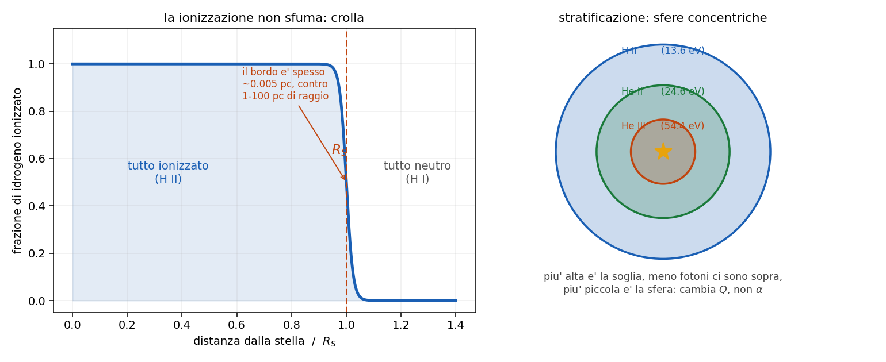

# 8 - La sfera di Stromgren

**Dispensa: cap. 8 (pag. 99-110).**

_Capitolo a **mattoncini**: si costruisce l' equazione un pezzo per volta, e poi si legge il
risultato negli andamenti. Il bordo, alla fine, e' il pezzo che sorprende di piu'._

Nel [capitolo 7](c07_ionizzazione.md) si e' fatto il bilancio fra ionizzazioni e ricombinazioni
**in un punto**. Adesso si guarda tutta la nube insieme e ci si fa la domanda geometrica:

> una stella calda dentro una nube di idrogeno. **Fin dove arriva la zona ionizzata?**

---

## 1. Il quadro

Una stella molto calda, tipo una O o una B, immersa in una nube di idrogeno.

Il raggio della stella e' **milioni di volte piu' piccolo** di quello della nube, quindi per questo
conto la stella e' un punto che sputa fotoni ionizzanti in tutte le direzioni.

L' idea di Stromgren e' che si arrivi a una situazione stazionaria: c'e' una regione ionizzata
attorno alla stella, e la sua dimensione e' fissata da un **equilibrio**.

---

## 2. Il ragionamento

Bisogna partire da una cosa: un atomo per **restare** ionizzato ha bisogno di essere continuamente
ri-ionizzato, perche' altrimenti prima o poi ricattura un elettrone.

Quindi non si contano atomi, si contano **tassi**: quante ionizzazioni al secondo e quante
ricombinazioni al secondo.

$$(\text{fotoni ionizzanti emessi dalla stella al secondo}) = (\text{ricombinazioni al secondo in tutta la sfera})$$

Il raggio $R_S$ e' quello per cui i due numeri si pareggiano: dentro quel raggio la stella ce la fa
a tenere tutto ionizzato, fuori non ce la fa piu'.

---

## 3. Il lato sinistro

Il tasso di emissione di fotoni ionizzanti (energia sopra 13.6 eV) della stella si chiama $Q$ e si
prende cosi' com'e', in fotoni al secondo. E' un dato della stella.

---

## 4. Il lato destro

Si costruisce a partire da un pezzo gia' visto nel [capitolo 5.5](c055_ricombinazione.md): le
ricombinazioni dirette sul livello $n$ sono

$$N_e N_p \alpha_n$$

Ma qui interessano le ricombinazioni su **tutti** i livelli, quindi si somma:

$$\sum_n N_e N_p \alpha_n = N_e N_p \sum_n \alpha_n$$

E questo e' il numero di ricombinazioni al secondo **per cm$^3$**. Per avere quelle di tutta la
sfera basta moltiplicare per il volume:

$$\frac{4}{3}\pi R^3 N_e N_p \sum_n \alpha_n$$

---

## 5. L'approssimazione "on the spot"

Adesso c'e' un passaggio che sembra un dettaglio tecnico ma non lo e'.

Vediamo cosa succede quando un elettrone ricombina finendo **direttamente sul fondamentale**
($n=1$): l' elettrone cade da libero fino a $-13.6$ eV, quindi emette un fotone da **13.6 eV**, che
e' esattamente un fotone ionizzante.

Quel fotone viene subito riassorbito li' vicino e ionizza un altro atomo. Quindi:

$$13.6 \, eV + \text{neutro} \rightarrow \text{ionizzato} \rightarrow \text{neutro} + 13.6 \, eV$$

**Il conto si pareggia**: quella ricombinazione ha prodotto il fotone che serve a rifare la
ionizzazione che ha appena annullato. Netto: zero.

Quindi le ricombinazioni su $n=1$ **non vanno contate**, e la somma parte da $n=2$:

$$\alpha_B = \sum_{n \geq 2} \alpha_n$$

Questo si chiama **on the spot approximation** (il "sul posto" e' perche' si assume che quel fotone
venga riassorbito subito li', senza viaggiare).

_**Vale la pena dirlo:** $\alpha_B$ si chiama **caso B**, e $\alpha_A$ (con dentro anche
$n=1$) e' il caso A. E' la stessa distinzione che c'e' dietro il valore 2.86 del decremento di
Balmer nel [capitolo 5.5](c055_ricombinazione.md): anche li' si assume caso B. Nelle nebulose si usa
sempre il caso B, perche' i fotoni di Lyman non escono mai vivi._

---

## 6. La formula

$$Q = \frac{4}{3} \pi R_S^3 \, N_e N_p \, \alpha_B$$

e isolando il raggio:

$$R_S = \left( \frac{3 Q}{4\pi N_e N_p \alpha_B} \right)^{1/3}$$

_**Attenzione:** la radice e' **cubica**, non quadrata. Viene dal volume della sfera, che va come
$R^3$._

---

### 6.1 Come si legge

**Dipendenza da $Q$: debolissima.**

$$R_S \propto Q^{1/3}$$

Se la stella emette **mille volte** piu' fotoni ionizzanti, il raggio cresce solo di **dieci**
volte. Ed e' ovvio a pensarci: il volume va come il cubo, quindi per raddoppiare il raggio serve
otto volte piu' roba.

**Dipendenza dalla densita': piu' forte.**

Assumendo $N_e \approx N_p = N$ (idrogeno puro completamente ionizzato):

$$R_S \propto N^{-2/3}$$

L' esponente e' $2/3$ e non $1/3$ perche' la densita' nella formula compare **due volte**: una per
gli elettroni e una per i protoni. Piu' e' densa la nube, piu' la sfera e' piccola: la stella
consuma i suoi fotoni piu' in fretta.

---

## 7. Il bordo

E qui c'e' la cosa che sorprende di piu'.

Verrebbe da pensare che la ionizzazione sfumi piano piano allontanandosi dalla stella. Invece no:
**crolla di colpo**.

| | quanto |
|---|---|
| raggio tipico della sfera | 1 - 100 pc |
| spessore del bordo | **~0.005 pc** |

Il bordo e' quattro ordini di grandezza piu' sottile del raggio. Su scala della nebulosa e'
praticamente una superficie.

---

### 7.1 Perché è così netto: il conto

Lo spessore del bordo e' la distanza in cui $\tau$ passa da 0 a 1, ed e' il libero cammino medio
della [capitolo 7](c07_ionizzazione.md):

$$L = \frac{1}{N \sigma} = \frac{1}{10 \times 6.3 \times 10^{-18}} \simeq 1.6 \times 10^{16} \; \text{cm} \simeq 0.005 \; pc$$

con $N = 10$ cm$^{-3}$ di idrogeno neutro e $\sigma = 6.3 \times 10^{-18}$ cm$^2$ (la sezione
d' urto per fotoni da 13.6 eV).

E piu' la nube e' densa, piu' il bordo e' sottile: a $N = 10^3$ cm$^{-3}$ viene $10^{-4}$ pc, cioe'
**paragonabile al sistema solare**.

---

### 7.2 Perché è così netto: il meccanismo

Il conto dice quanto e' spesso, ma il motivo per cui e' un crollo e non una sfumatura e' un
**effetto a valanga**:

$$\text{piu' idrogeno neutro} \rightarrow \text{piu' assorbimento} \rightarrow \text{meno fotoni sopravvivono} \rightarrow \text{piu' idrogeno neutro}$$

E' un anello che si rinforza da solo. Appena la ionizzazione comincia a calare, cala sempre piu' in
fretta.

_**Questa e' la parte che conta:** un piccolo avvertimento. Tutto questo dipende dalla **forma del
continuo ionizzante**: se la stella produce tanti fotoni molto energetici, quelli vedono $\sigma$
piccola (va come $\nu^{-3}$) e viaggiano molto piu' lontano, quindi il bordo si ammorbidisce._

---

## 8. Ionization bounded e matter bounded

Due situazioni completamente diverse, e conviene saperle distinguere.

**Ionization bounded**: e' il caso descritto finora. C'e' idrogeno in abbondanza, e a finire sono
i **fotoni**. Il raggio e' quello di Stromgren e la formula vale.

**Matter bounded**: la nube e' piu' piccola della sfera di Stromgren che le competerebbe. A finire
e' la **materia**: la stella avrebbe ancora fotoni da spendere, ma non c'e' piu' niente da
ionizzare, e quei fotoni escono nello spazio.

> nel caso matter bounded la formula di $R_S$ **non si applica**: il raggio della zona ionizzata e'
> semplicemente il raggio della nube.

Il modo di distinguerli osservativamente: in una nebulosa matter bounded non si vede la buccia di
gas neutro attorno, e la radiazione ionizzante scappa fuori.

---

## 9. Stratificazione della ionizzazione

Attorno alla stella non c'e' solo idrogeno: c'e' anche elio, e ci sono i metalli. E ogni specie ha
la sua soglia:

| specie | soglia |
|---|---|
| H I | 13.6 eV |
| He I | 24.6 eV |
| He II | 54.4 eV |

Ognuna ha quindi la **sua** sfera di Stromgren, e le sfere sono **concentriche**: la zona He III
sta dentro la zona He II, che sta dentro la zona H II.

---

### 9.1 Perché le sfere hanno raggi diversi

Questo e' il punto da capire bene, perche' e' facile dare la risposta sbagliata.

Guardando la formula, verrebbe da pensare che cambi $\alpha_B$. Ma il motivo vero e' un altro:
**cambia $Q$**.

$Q$ e' il numero di fotoni **sopra la soglia**. La stella emette come un corpo nero, quindi il suo
spettro cala esponenzialmente sulla coda di Wien: piu' alzi la soglia, meno fotoni trovi sopra.

- sopra 13.6 eV ce ne sono tanti
- sopra 24.6 eV molti meno
- sopra 54.4 eV pochissimi (e solo le stelle piu' calde ne hanno)

Meno fotoni disponibili -> sfera piu' piccola.

_**Attenzione al verso:** salendo in **energia** ci sono meno fotoni. Non "salendo in
temperatura": alzando la temperatura della stella i fotoni energetici **aumentano**. La coda di
Planck si legge lungo l' asse dell' energia a temperatura fissata._

---

### 9.2 A cosa serve saperlo

La stratificazione e' osservabile: guardando una nebulosa si vedono le righe di ioni diversi in
zone diverse, e piu' lo ione e' "alto" piu' sta vicino alla stella.

Da come sono messe quelle zone si risale alla **temperatura della stella** che le illumina, anche
senza vederla bene.

---

## 10. In breve

- **equilibrio**: i fotoni ionizzanti emessi al secondo pareggiano le ricombinazioni al secondo in
  tutta la sfera
- $Q = \frac{4}{3}\pi R_S^3 N_e N_p \alpha_B$, da cui
  $R_S = \left( \frac{3Q}{4\pi N_e N_p \alpha_B} \right)^{1/3}$ (radice **cubica**)
- **on the spot**: le ricombinazioni su $n=1$ producono un fotone ionizzante e si annullano da
  sole, quindi si somma da $n=2$ -> $\alpha_B$, il **caso B**
- $R_S \propto Q^{1/3}$: mille volte piu' fotoni = dieci volte il raggio
- $R_S \propto N^{-2/3}$: l' esponente e' $2/3$ perche' la densita' compare due volte
- il **bordo e' sottilissimo**: 0.005 pc contro 1-100 pc di raggio, perche'
  $L = 1/(N\sigma)$ ed e' un effetto a valanga
- **ionization bounded** = finiscono i fotoni (formula valida); **matter bounded** = finisce la
  materia (formula non valida)
- **stratificazione** He II / He III: cambia **$Q$**, non $\alpha$, perche' sulla coda di Planck ci
  sono meno fotoni sopra soglie piu' alte

---

## Domande tattiche

**1.** Prendi una stella e mettici attorno una nube dieci volte piu' densa. Il raggio di Stromgren
di quanto cambia? Attento all' esponente, e sappi dire da dove viene. (-> sezione 6.1)

**2.** Perche' nella somma delle ricombinazioni si parte da $n=2$ e non da $n=1$? Racconta cosa
succede a quel fotone. (-> sezione 5)

**3.** Il raggio della sfera e' di 10 pc e il bordo e' spesso 0.005 pc. Come mai cosi' netto? Ci
sono due risposte, una col conto e una col meccanismo: dille tutte e due. (-> sezioni 7.1 e 7.2)

**4.** Ti dicono che una certa nebulosa e' matter bounded. Puoi ancora usare la formula di $R_S$?
E cosa ti aspetti di vedere attorno? (-> sezione 8)

**5.** La sfera di He III e' piu' piccola di quella di H II. Verrebbe da dire che e' perche' l' elio
ricombina diversamente. Perche' e' la risposta sbagliata, e qual e' quella giusta? (-> sezione 9.1)

**6.** Se una stella emette mille volte piu' fotoni ionizzanti, il raggio cresce solo di dieci
volte. Perche' cosi' poco? La risposta e' geometrica. (-> sezione 6.1)
