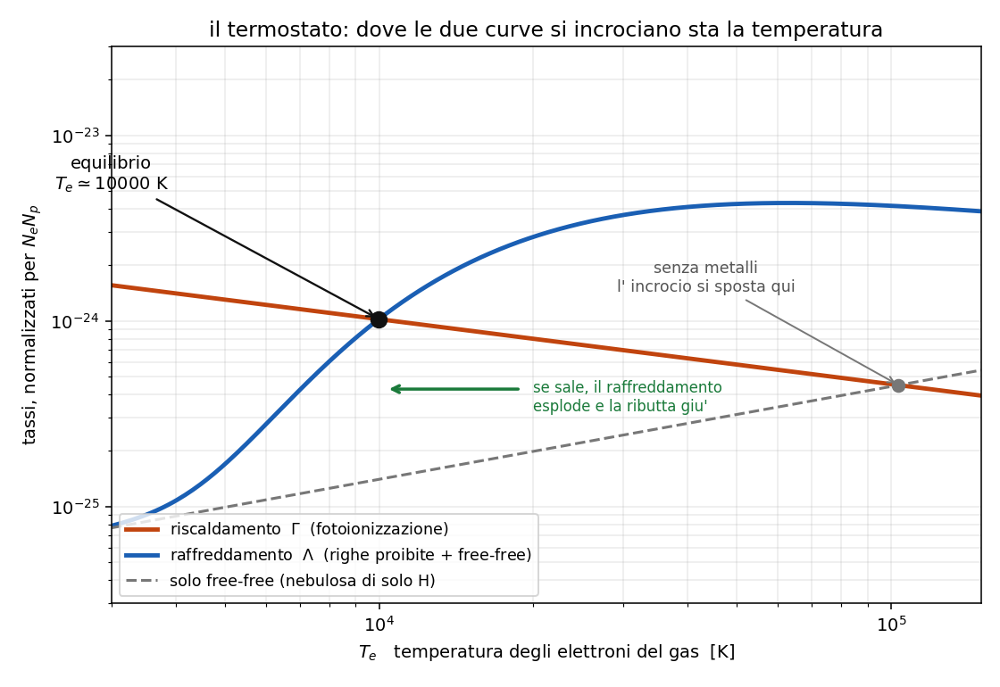

# 9 - Equilibrio termico: chi scalda e chi raffredda

**Dispensa: cap. 9 (pag. 111 e seguenti).**

_Capitolo in **PODS**: si parte da una domanda che sembra ingenua (perche' non si scalda
all' infinito?) e si finisce con un grafico che spiega tutto il corso._

Ultimo capitolo, e chiude un cerchio. Per tutto il corso si e' detto "una nebulosa sta a $10^4$ K"
e lo si e' usato per fare i conti. Adesso si spiega **perche'** ci sta.

La domanda e':

> la stella pompa energia nella nebulosa in continuazione. Perche' allora non si scalda
> all' infinito?

---

## 1. L'equazione

Perche' due processi opposti si pareggiano:

$$\Gamma = \Lambda$$

$\Gamma$ $\quad$ tasso di **riscaldamento**: energia data al gas per unita' di volume e di tempo,
in erg cm$^{-3}$ s$^{-1}$

$\Lambda$ $\quad$ tasso di **raffreddamento**, stesse unita'

La temperatura si assesta al valore in cui i due si eguagliano. Ed e' il motivo per cui **tutte**
le nebulose fotoionizzate stanno intorno a $10^4$ K, indipendentemente da quanto e' grande la
stella che le illumina.

---

## 2. Chi scalda: la fotoionizzazione

Il capo assoluto e' la **fotoionizzazione**, ed e' facile da capire.

Arriva un fotone stellare con energia sopra la soglia, diciamo 20 eV. Ne spende 13.6 per strappare
l' elettrone, e **i 6.4 eV che avanzano se li porta via l' elettrone come energia cinetica**.

Quell' elettrone poi sfreccia in giro, urta gli altri, e distribuisce l' energia a tutto il gas.
**Il gas si scalda.**

$$\bar{E}_e = \frac{\int_{\nu_0}^{\infty} h(\nu - \nu_0) \frac{k_\nu I_\nu}{h\nu} d\nu}{\int_{\nu_0}^{\infty} \frac{k_\nu I_\nu}{h\nu} d\nu}$$

$\bar{E}_e$ $\quad$ energia cinetica media del singolo elettrone liberato

$h(\nu - \nu_0)$ $\quad$ l' energia in eccesso sulla soglia, quella che finisce all' elettrone

$\frac{k_\nu I_\nu}{h\nu}$ $\quad$ il numero di fotoionizzazioni per unita' di volume e di tempo

Cioe': e' la media dell' energia in eccesso, pesata su quante fotoionizzazioni avvengono a ogni
frequenza.

---

### 2.1 La cosa importante di questa formula

Guarda cosa c'e' sopra e sotto: $I_\nu$ compare in tutti e due, e **si semplifica**.

> **$\bar{E}_e$ dipende dallo spettro della stella, non dalla sua intensita'.**

Vuol dire che una stella lontana o vicina scalda gli elettroni allo stesso modo: cambia **quanti**
ne libera, non **quanto energetici** sono. Quello che conta e' la temperatura della stella, che
decide la forma dello spettro.

Vicino alla stella, con l' approssimazione di Wien, viene:

$$\bar{E}_e = \psi_0 k_B T$$

con $\psi_0$ dell' ordine di 1 (e $T$ e' la temperatura della **stella**, non del gas).

---

### 2.2 Un effetto di indurimento

Siccome $k_\nu \propto \nu^{-3}$ (vedi la [capitolo 7](c07_ionizzazione.md)), i fotoni
piu' energetici attraversano la nube senza essere assorbiti, mentre quelli appena sopra soglia
vengono mangiati subito.

Conseguenza: **piu' ci si allontana dalla stella, piu' gli elettroni liberati escono energetici**,
perche' li' arrivano solo i fotoni duri.

---

### 2.3 Il bilancio netto

Il riscaldamento vero non e' tutta l' energia che entra: bisogna togliere quella che se ne va con le
ricombinazioni, perche' l' elettrone catturato si porta via la sua energia cinetica.

$$\Gamma_{ph} = N_1 N_e \left[ \alpha_0 \bar{E}_e - \frac{1}{2} m_e \langle \sigma_{fb} v^3 \rangle \right]$$

Il primo pezzo e' quello che entra, il secondo quello che esce.

E qui torna il risultato del [capitolo 7](c07_ionizzazione.md): $\sigma_{fb}$ **cala** al crescere
di $v$, quindi a farsi catturare sono soprattutto gli elettroni **lenti**. Entrano elettroni
veloci ed escono elettroni lenti: il bilancio e' positivo, il gas si scalda.

---

### 2.4 Gli altri canali (minori)

- ionizzazione di H I da **raggi cosmici**
- **effetto fotoelettrico** sulla superficie dei grani di polvere
- evaporazione di molecole H$_2$ dai grani

---

## 3. Chi raffredda: le righe proibite dei metalli

E qui si capisce perche' il [capitolo 5.7](c057_righe_proibite.md) era cosi' importante.

Il meccanismo, in tre passi:

1. un elettrone libero **urta** uno ione dei metalli (O, N, S) e lo porta su un livello
   **metastabile** poco sopra il fondamentale. Quell' urto **toglie energia cinetica al gas**.
2. lo ione decade ed emette un fotone.
3. la nebulosa e' otticamente sottile a quella riga, quindi **il fotone se ne va** portandosi
   dietro l' energia.

Netto: quell' energia il gas non se la riprende piu'.

---

### 3.1 Perché sono i metalli e non l'idrogeno

Questa e' la domanda giusta da farsi, e la risposta e' un confronto fra due numeri.

A $10^4$ K gli elettroni hanno $k_B T_e = 0.86$ eV.

| specie | primo livello raggiungibile | ci arrivano? |
|---|---|---|
| idrogeno | **10.2 eV** | no, mai |
| [O III], [N II], [S II] | **2-5 eV** | si' |

L' idrogeno e' fuori portata: per eccitarlo servirebbero elettroni dodici volte piu' energetici
della media, e la coda della maxwelliana non ne fornisce abbastanza.

I metalli invece hanno i livelli metastabili a pochi eV, per il motivo visto nel
[capitolo 5.7](c057_righe_proibite.md) (stessa configurazione elettronica del fondamentale).

_**Nota subito così de botto:** fa una certa impressione. I metalli sono una traccia, tipo un
atomo su diecimila. Eppure sono loro a fissare la temperatura di tutta la nebulosa, perche' sono
gli unici che gli elettroni riescono a eccitare. La roba che c'e' in abbondanza non serve a niente
se sta troppo in alto._

---

### 3.2 La formula

$$\Lambda_{coll} = N_e \sum_m (E_m - E_1)(N_{i1} Q_{1m} - N_{im} Q_{m1})$$

$(E_m - E_1)$ $\quad$ l' energia del salto fondamentale -> metastabile

$N_{i1} Q_{1m}$ $\quad$ le eccitazioni: **energia tolta** al gas

$N_{im} Q_{m1}$ $\quad$ le diseccitazioni collisionali: **energia restituita** al gas

Il secondo termine e' quello che rovina tutto quando la densita' e' alta. Se ne parla fra due
paragrafi.

Per [O III] 5007, mettendo dentro i numeri:

$$\Lambda \simeq 1.57 \times 10^{-21} N_e N_p \frac{e^{-2.877 \times 10^4 / T_e}}{\sqrt{T_e}}$$

**Il pezzo che conta e' quell' esponenziale.** $2.877 \times 10^4$ K e' $\Delta E / k_B$ della riga
5007. Il raffreddamento e' **spento** a bassa temperatura e **si accende di colpo** quando $T_e$ si
avvicina a quella soglia.

---

### 3.3 Gli altri canali di raffreddamento

**Free-free** (bremsstrahlung, vedi [capitolo 6](c06_continui.md)):

$$\Lambda_{ff} \propto N_e N_p \sqrt{T_e}$$

Va come $\sqrt{T_e}$, quindi cresce **piano**, senza soglie e senza esponenziali. E' il
raffreddamento **dominante in una nebulosa di solo idrogeno**, dove non ci sono metalli.

**Ricombinazione**: l' elettrone catturato si porta via la sua energia cinetica. E' gia' contato
dentro $\Gamma_{ph}$ col segno meno.

**Collisioni con i grani di polvere.**

---

## 4. Il termostato

Adesso il pezzo che spiega tutto, ed e' un grafico da saper disegnare.

Si mettono in scala logaritmica i due tassi (normalizzati per $N_e N_p$) in funzione di $T_e$:

**sull' asse X**: $T_e$, la temperatura degli elettroni del gas

**sull' asse Y**: i tassi $\Gamma$ e $\Lambda$

E le due curve hanno forme molto diverse:

- **$\Gamma_{ph}$ e' quasi piatta**, anzi cala piano. Il motivo e' il punto 2.1: l' energia che il
  fotone regala all' elettrone la decide **la stella**, e la temperatura del gas non c' entra
  niente.
- **$\Lambda$ sale**, e quella collisionale sale **ripidissima**, per via dell' esponenziale
  $e^{-\Delta E / k_B T_e}$.

**Dove le due curve si incrociano c'e' la temperatura di equilibrio.**

---

### 4.1 Perché è un termostato vero

Guarda cosa succede se ci si sposta dall' incrocio:

- **$T_e$ sale sopra**: il raffreddamento esplode (esponenziale) mentre il riscaldamento resta
  quello -> la temperatura viene ributtata giu'
- **$T_e$ scende sotto**: il raffreddamento si spegne di colpo mentre il riscaldamento continua ->
  la temperatura risale

E' un equilibrio **stabile**, e si autoregola. Per questo tutte le nebulose con metalli finiscono
intorno a $10^4$ K.

---

### 4.2 Una nebulosa di solo idrogeno

Caso limite da tenersi in tasca, perche' fa vedere quanto contano i metalli.

Senza metalli non c'e' il raffreddamento collisionale: resta solo il free-free, che va come
$\sqrt{T_e}$ ed e' molto meno efficiente.

La curva di $\Lambda$ e' molto piu' bassa e molto meno ripida, quindi **l' incrocio si sposta a
temperature nettamente piu' alte**.

Detto altrimenti: sono i metalli a tenere fredde le nebulose.

---

## 5. Il legame col quenching

Torna il [capitolo 5](c051_atomo_due_livelli.md), e stavolta con una conseguenza grossa.

> **la riga raffredda solo se il fotone esce.**

Se la densita' supera $N_c$, lo ione eccitato viene **spento da un secondo urto** prima di riuscire
a emettere: l' energia torna all' elettrone che lo ha urtato e **resta dentro il gas**.

Quindi: sopra la densita' critica, quel canale di raffreddamento **si spegne**, e la temperatura di
equilibrio **sale**.

E' il termine $N_{im} Q_{m1}$ della formula al punto 3.2: sotto $N_c$ e' trascurabile, sopra $N_c$
cresce fino a cancellare quasi del tutto il primo pezzo.

---

## 6. E se la stella si spegne di colpo?

Domanda che chiude bene il corso, perche' obbliga a usare tutto quello che si e' visto.

Succede questo: la nebulosa si raffredda, tutto ricombina, righe e continuo spariscono, e nel
visibile non la vedi piu' (ma e' ancora li': va cercata a lunghezze d' onda maggiori).

Quanto ci mette? Si divide l' energia termica che c'e' da smaltire per il tasso a cui la si smaltisce:

$$t_c = \frac{\frac{3}{2} k_B T N_p}{\Lambda}$$

Coi numeri di una nebulosa a $10^4$ K:

$$t_c \sim \frac{10^{12}}{N_p} \; \text{s}$$

Con $N_p = 10^2$ cm$^{-3}$: circa **300 anni**. In una nebulosa di solo idrogeno, dove raffredda
solo il free-free, ci mette circa dieci volte tanto.

---

### 6.1 Il tempo di ricombinazione

L' altro tempo caratteristico e':

$$t_r = \frac{1}{N_e \alpha_0}$$

Con gli stessi numeri viene circa **800 anni**.

_**In pratica:** tutti e due i tempi vanno come $1/N$. Quindi **piu' e' densa la
nebulosa, piu' in fretta si spegne.** E' lo stesso motivo di sempre: le cose succedono per
incontri, e in un gas denso ci si incontra piu' spesso._

---

## 7. In breve

- la temperatura sta ferma perche' $\Gamma = \Lambda$, ed e' per questo che tutte le nebulose
  fotoionizzate stanno a $\sim 10^4$ K
- **scalda la fotoionizzazione**: l' energia in eccesso sopra la soglia se la porta via l' elettrone
  come energia cinetica
- $\bar{E}_e$ dipende dallo **spettro** della stella, non dalla sua intensita' (si semplifica)
- **raffreddano le righe proibite dei metalli** eccitate per urto: l' urto ruba energia al gas e il
  fotone la porta fuori
- sono i metalli perche' a $k_BT_e = 0.86$ eV i loro livelli metastabili (2-5 eV) sono
  raggiungibili e i 10.2 eV dell' idrogeno no
- **il grafico**: $\Gamma$ quasi piatta, $\Lambda$ che sale ripida per l' esponenziale, e
  l' incrocio fissa $T_e$
- e' un equilibrio **stabile**: se $T_e$ sale il raffreddamento esplode, se scende si spegne
- in una nebulosa di **solo H** raffredda solo il free-free, molto meno efficiente ->
  temperatura di equilibrio **piu' alta**
- **quenching**: sopra $N_c$ il fotone non esce, l' energia resta nel gas, quella riga non
  raffredda piu' e la temperatura sale

---

## Domande tattiche

**1.** Una nebulosa viene scaldata in continuazione dalla stella. Perche' non arriva a un milione
di gradi? (-> sezioni 1 e 4.1)

**2.** I metalli sono un atomo su diecimila, eppure sono loro a decidere la temperatura. Come si
spiega? Il confronto e' fra due numeri soli. (-> sezione 3.1)

**3.** L' energia che il fotone regala all' elettrone dipende da quanto e' vicina la stella?
(-> sezione 2.1)

**4.** Disegna il grafico del termostato: cosa metti sui due assi, che forma hanno le due curve, e
perche' proprio quelle forme? (-> sezione 4)

**5.** Prendi una nebulosa e alza la densita' sopra la densita' critica di [O III]. La temperatura
di equilibrio sale o scende? Fai il percorso completo. (-> sezione 5)

**6.** In una nebulosa di solo idrogeno la temperatura di equilibrio e' piu' alta o piu' bassa che
in una coi metalli? E chi raffredda, li'? (-> sezione 4.2)

**7.** La stella si spegne di colpo. Cosa vedi succedere, e in quanto tempo? E la nebulosa piu'
densa si spegne prima o dopo? (-> sezioni 6 e 6.1)
